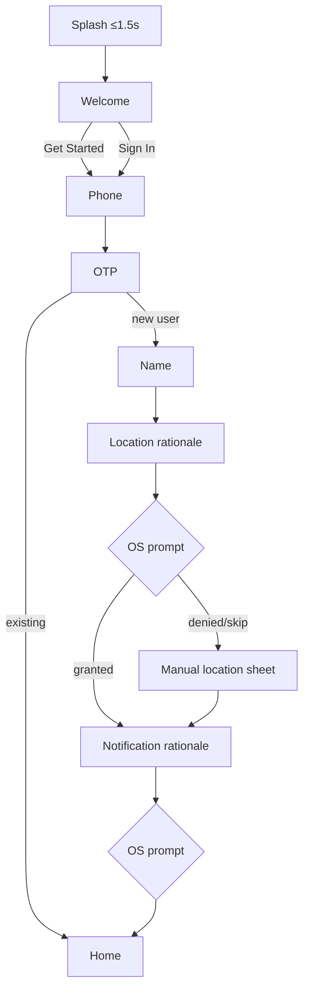
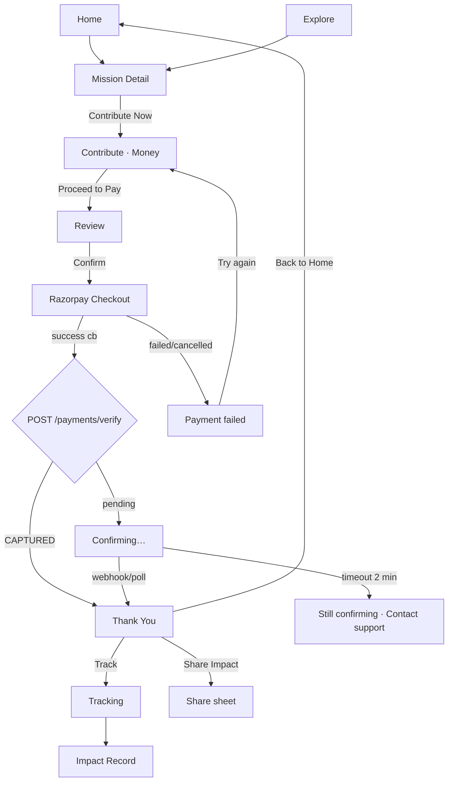
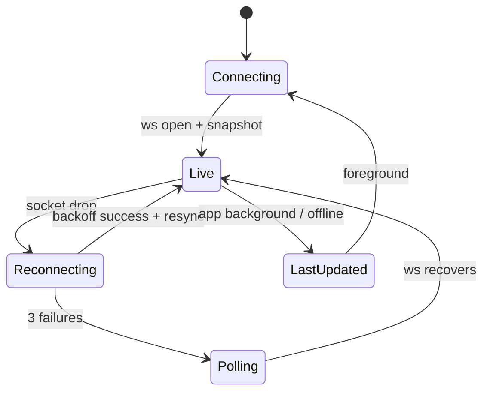
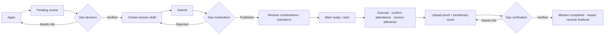

# NEKI — User Flows

| Field | Value |
|---|---|
| Version | 1.0 |
| Date | 2026-09-07 |
| Related | `01-prd.md` (FR ids), `02-tdd.md` (states, endpoints), `04-design-brief.md` (screens) |

Notation: **Screen** in bold; `system` actions in code; ⚠ branch/error; ✓ exit condition. Screen names match the reference board.

---

## F0 — First launch to Home (FR-01, FR-02)



| # | Screen | User | System | Branches |
|---|---|---|---|---|
| 1 | **Splash** | — | `bootstrap; read session; prefetch categories` | Valid refresh token → Home directly |
| 2 | **Welcome** | Tap Get Started / Sign In | — | |
| 3 | **Phone** | Enter +91 number | `POST /auth/otp/request` | ⚠ invalid → inline error; ⚠ rate-limited → "Try again in X min" |
| 4 | **OTP** | Enter 6 digits (auto-read Android) | `POST /auth/otp/verify` → tokens | ⚠ wrong (≤5) → shake + count; ⚠ expired → Resend enabled at 30 s; ⚠ lockout 15 min |
| 5 | **Name** | First + last | `PATCH /me` | Not skippable — first name needed for greeting |
| 6 | **Location rationale** | Read "See missions near you…" → Allow / Not now | OS prompt on Allow | Denied → **Location sheet** (search city) |
| 7 | **Notification rationale** | Allow / Not now | OS prompt | |
| 8 | **Home** | — | `GET /home?lat&lng` | ✓ `onboarding_completed` |

Exit criteria: ≤ 6 taps; Home visible with location label.

---

## F1 — Money contribution (Journey A; FR-06, FR-07, FR-10, FR-11)



| # | Screen | User | System | Notes / branches |
|---|---|---|---|---|
| 1 | **Home** | Tap featured card "Provide 200 meals…" | `mission_viewed(source=home_featured)` | |
| 2 | **Mission Detail** | Read need, progress (₹12,400 of ₹20,000 · 62%), org, trust badges | `GET /missions/{id}` | ⚠ fully funded → CTA "Mission Fully Funded" + Explore Similar; ⚠ closed → "Mission Closed" |
| 3 | | Tap **Contribute Now** | `contribution_started` | Push transition |
| 4 | **Contribute** | Money tab active; tap ₹1,000 or type Other | `amount_selected` | Proceed disabled until ≥ ₹10; fee line shows split |
| 5 | | Tap **Proceed to Pay →** | `POST /missions/{id}/contributions` (Idempotency-Key) → contribution PENDING_PAYMENT + order | ⚠ 409 MISSION_UNAVAILABLE → sheet explaining, Explore Similar |
| 6 | **Review** | Verify mission, ₹1,000, fee, method (UPI default); toggle Anonymous; Confirm | `contribution_reviewed` | Back allowed; amount edit returns to step 4 |
| 7 | **Razorpay Checkout** | Complete UPI / card | provider | ⚠ user cancels → step 8b |
| 8a | **Confirming** | wait | `POST /payments/{id}/verify`; poll `GET /contributions/{id}` every 2 s ≤ 2 min; WS `contribution.updated` | Copy: "We're confirming your contribution." Never show failure here |
| 8b | **Payment failed** | Try Again / Contact Support | contribution stays PENDING_PAYMENT until expiry 30 min | Copy: "No contribution has been recorded yet." |
| 9 | **Thank You** | Checkmark draws; "Your contribution brings us one step closer to a kinder world." | `payment_completed`, `contribution_completed` | Haptic success; reduced-motion variant |
| 10 | | Tap **Share Impact** / **Back to Home** / **Track** | share deep link (no amount unless user opts) | |
| 11 | **Tracking** (money) | Timeline: Payment confirmed ✓ → Received by organization → Deployed → Delivery proof → Verified | WS channel `contribution:{id}` | |
| 12 | **Impact Record** | NK-id, proof gallery, verification state | `GET /impact/records/{id}` | Reached from Activity feed or push "Impact verified" |

Timing goal: steps 1→9 median ≤ 90 s.

---

## F2 — Item contribution with pickup (Journey B; FR-08, FR-10)

| # | Screen | User | System | Branches |
|---|---|---|---|---|
| 1 | **Home → Category (Food)** | Tap Food tile; subcategory "Rations" | `category_viewed` | |
| 2 | **Mission Detail** | "Food Kits for Daily Wage Workers" → Contribute Now | | ⚠ mission has no item needs → Items tab hidden |
| 3 | **Contribute · Items** | Select item (from mission needs: e.g., Rice 5 kg bags) | | |
| 4 | | Quantity stepper (min 1, max remaining) | | ⚠ exceeds remaining → clamp + hint |
| 5 | | Condition: New / Good / Fair | | Food items: expiry date field instead |
| 6 | | Add 1–5 photos (camera/gallery) | `POST /media/upload-url` → PUT → complete; EXIF stripped | ⚠ upload fails → retry chip per photo; can continue with ≥1 |
| 7 | | Pickup address: saved / new (map pin + form) | `GET /me/addresses`, `POST /me/addresses` | ⚠ outside service area → "We can't pick up here yet" + Drop-off option if org allows |
| 8 | | Pickup window: date + 2 h slot | `GET /pickup-slots` | ⚠ no slots → next available dates |
| 9 | **Review** | Item, qty, condition, photos, address, slot; Confirm | `POST /missions/{id}/contributions type=ITEM` → CONFIRMED + shipment CREATED | |
| 10 | **Thank You** | "We'll pick up your contribution on Sat, 10–12." | `contribution_completed(items)` | |
| 11 | **Tracking** | Timeline: Confirmed ✓ → Volunteer assigned → Pickup ready → Picked up → On the way → Delivered → Verified | WS | Reschedule allowed until VOLUNTEER_ASSIGNED |
| 12 | Push | "Ravi has picked up your contribution and is on the way. ETA 8 min" | FCM deep link | |
| 13 | **Impact Record** | Delivered date, proof photos, "5 food kits → 5 families (reported by organization)" | | Verified label after ops review |

---

## F3 — Volunteer for a mission (Journey C; FR-09)

**D7 approval gate:** Browsing is available before approval. The Volunteer CTA requires OTP and a basic profile, then opens an application (availability, area, skills, SOP consent) if none exists. Submission shows `PENDING_REVIEW`; only an ops approval unlocks booking. Pending applicants see their status; rejected applicants see the decision and support/reapplication guidance once that policy is defined. Rework, reapplication, suspension, and review transitions remain P0 contract work (G14/G29), not invented client states. No government-ID/KYC is collected in MVP.

Before booking or waitlist promotion, the server rechecks current approval, slot eligibility, and required enhanced manual checks. Revoked or suspended approval blocks new bookings; recovery of existing assignments requires the pending ops policy. A cached approval or open sheet never authorizes a booking.

| # | Screen | User | System | Branches |
|---|---|---|---|---|
| 1 | **Explore** | Filter Contribution type = Time | `filter_applied` | |
| 2 | **Mission Detail** | Tap **Volunteer for this mission** | `volunteer_started` | ⚠ slots full → "Join waitlist" |
| 3 | **Volunteer sheet** | Choose role (e.g., Kitchen helper), date, slot; read requirements (4 h, standing, 18+) | | ⚠ age requirement unmet → blocked with reason |
| 4 | | Confirm | `POST /missions/{id}/volunteer` → assignment CONFIRMED | Adds to calendar (optional) |
| 5 | **Activity** | Upcoming card with date, location, organizer | | Cancel allowed ≥ 12 h before |
| 6 | Push | T-24 h and T-2 h reminders | | |
| 7 | **Assignment detail** | Day-of: Navigate; **Check in** | `POST /assignments/{id}/checkin` (geofence 300 m) | ⚠ outside geofence → "Ask organizer to confirm" (org portal confirms) |
| 8 | | Execute; optional proof photos | outbox queue if offline | |
| 9 | | **Check out** | `POST …/checkout` → hours computed | ⚠ forgot → org can close at slot end |
| 10 | Org portal | Organizer confirms attendance | HOURS_VERIFIED | |
| 11 | **Activity → Impact Record / Certificate detail** | Hours count in stats only after verification | Certificate metadata only in MVP; no PDF download action | |

---

## F4 — Discover anything (Journey D; FR-03, FR-04, FR-05)

```
Home → search "books near me" → Suggestions (Education · School Supplies · "books") → Results
  Missions (School Kits for Delhi Students · 42% funded · Delhi NCR) / Organizations / Categories
→ Mission Detail → Contribute (Items: Books ×150) or Money
```
Branches: no results → "No missions match" + Reset filters + Explore All; offline → search disabled, cached Explore list shown.

---

## F5 — Tracking and realtime (FR-10)



UI states: Connecting ("Connecting…"), Live (green pulse + "Live"), Reconnecting ("Reconnecting…"), Last updated ("Connection interrupted. Showing latest update from 10:42 AM.").

Shipment timeline mapping (contributor copy):

| Shipment state | Timeline label | Copy |
|---|---|---|
| CREATED / CONFIRMED | Order confirmed | "We've received your contribution." |
| VOLUNTEER_ASSIGNED | Volunteer assigned | "Ravi will pick up your contribution." |
| PICKUP_READY | Pickup scheduled | "Pickup window: Sat 10–12." |
| PICKED_UP | Picked up | "Ravi has picked up your contribution." |
| IN_TRANSIT | On the way · Live | ETA bubble |
| ARRIVED | Arrived | "Arrived at ABC Foundation." |
| DELIVERED | Delivered | "Delivered. Proof pending." |
| VERIFIED | Verified | "Impact verified." |
| DELAYED | Delayed | "Running late. New ETA 25 min." |
| ISSUE_REPORTED | Issue reported | Explanation + support link |
| CANCELLED | Cancelled | Reason, refund status if any, next steps |

---

## F6 — Returning user with active contribution (FR-03)

```
Launch → Home renders cached shell → module "Continue Your Impact" pinned first:
  "Your contribution is on the way · Track now →" → Tracking
Else if upcoming volunteer slot within 48 h → "Your mission starts Sat 10 AM · Details →"
Else standard ordering.
```

---

## F7 — Organization: publish mission to verified impact (FR-15, FR-17)



Portal screens: Apply → Dashboard → Missions (list, editor with needs builder: Money target / Item need type+qty / Volunteer roles+slots) → Mission detail (contributions, assignments, shipments) → Proof upload (photos, acknowledgement PDF, beneficiary count, consent attestation) → Impact.

Guards: cannot edit targets after first contribution without ops approval; cannot publish before org VERIFIED; cannot submit proof before DELIVERED.

---

## F8 — Ops: verification and dispatch (FR-16)

**Organization verification:** Queue → Org detail (documents viewer, registration lookup checklist, history) → Decision (Verified / Needs more information with message / Rejected with reason) → audit entry → notification to org.

**Mission moderation:** Queue → Mission preview as contributor sees it → checklist (quantified need, realistic deadline, location, proof requirement set, imagery appropriate) → Publish / Needs info / Reject.

**Proof review:** Queue sorted by mission deadline → side-by-side: requirements vs proof; auto-checks shown (capture time in window ✓, geotag within 300 m ✓, image hash unique ✓) → Verify / Needs info / Reject → impact records finalized → contributors notified.

**Dispatch:** Board of shipments by state; unassigned pickups by slot; assign volunteer (nearby, availability) or partner; reassign on no-show; mark delayed with new ETA; cancel with refund decision.

**Disputes/refunds:** Case list → contribution + payment detail → Refund (full/partial, reason) → provider call → status via webhook → user notified.

---

## F9 — Volunteer field operations for pickups (FR-08, FR-09, offline)

**Assignment precondition (D7):** Ops can assign only a currently approved volunteer with the required enhanced manual checks. Unapproved users follow the application/status flow in F3. The server rechecks approval and assignment scope on field actions; cached assignments do not grant continuing access after revocation. Suspension/reassignment and private-cache expiry are open contracts in G14/G22/G25. Offline actions remain pending until accepted; rejected actions show recovery guidance rather than completed delivery.

| # | Screen | Action | System | Offline behaviour |
|---|---|---|---|---|
| 1 | **Activity → Assigned pickup** | View address (revealed only within window), items, contributor first name | | Cached |
| 2 | | Navigate (opens maps app) | | |
| 3 | | **Picked up** (+ photo) | `POST /shipments/{id}/transition PICKED_UP` | Queued; badge "Pending sync" |
| 4 | | Location pings while foregrounded | `POST /shipments/{id}/pings` batched 10 s | Dropped when offline (ETA gaps) |
| 5 | | **Arrived** → **Delivered** (+ photo, org confirms via portal or QR) | transitions | Queued; server rejects out-of-order with 409 → UI explains |
| 6 | | Done → hours & delivery recorded | | Sync on reconnect |

---

## F10 — Edge-case matrix

| Situation | Screen behaviour |
|---|---|
| Mission fully funded during checkout (before order) | 409 → sheet: "This mission was just fully funded." Explore Similar |
| Payment captured but mission cancelled later | Contribution → REFUND_PENDING; tracking shows Cancelled + refund status + timeline; push |
| Webhook delayed > 2 min | Confirming screen → "Taking longer than usual. We'll notify you." Home shows pending card; never "failed" |
| Duplicate tap on Confirm | Button disabled at first tap; same Idempotency-Key returns same contribution |
| App killed mid-checkout | On relaunch, Home "Continue Your Impact" shows pending contribution with Resume/Cancel; reconciliation resolves |
| Organization becomes unverified after contribution | Mission paused; contributors notified "Verification status changed"; refunds per policy |
| Volunteer no-show for pickup | Ops reassign; contributor sees Rescheduled + new slot |
| Proof rejected | Mission back to DELIVERED with Needs more information; contributor sees "Impact verification in progress" (not rejection details) |
| Deadline passes, partially funded, `allow_partial=false` | EXPIRED → refunds; contributors notified with reason |
| Deadline passes, `allow_partial=true` | READY with partial; org executes; impact summary reflects actual quantity |
| Location permission denied | Manual city; distance tiles hidden; pickup requires typed address |
| Map tiles fail | Tracking shows timeline-only layout with ETA text |
| Offline on Home | Cached feed + banner "You're offline. Showing your latest saved information." |
| Dynamic Type 200% | CTAs wrap to two lines, never truncate; sticky footer grows |
