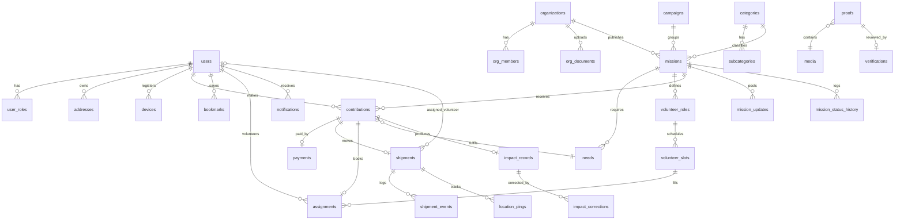

# NEKI — Data Model

| Field | Value |
|---|---|
| Version | 1.0 |
| Date | 2026-09-07 |
| Database | PostgreSQL 16 + PostGIS 3.4 + pg_trgm + pgcrypto |
| Related | `02-tdd.md §5–7, §10–13` |

---

## 1. Conventions

- Primary keys: `id uuid default gen_random_uuid()`. Public-facing ids: `public_id text unique` (e.g., `NK-48291` for impact records, `msn_7f3k…` for missions) — never expose internal uuids in URLs where enumeration matters.
- Timestamps: `created_at timestamptz not null default now()`, `updated_at timestamptz not null default now()` (trigger), all UTC.
- Soft delete: `deleted_at timestamptz null` on user-owned entities; hard delete only via retention jobs.
- Money: `bigint` paise + `currency char(3) default 'INR'`.
- Geography: `geography(Point, 4326)`; discovery uses rounded points; addresses hold precise points.
- Enums as PostgreSQL `enum` types (listed §2); adding values via `ALTER TYPE … ADD VALUE` in expand/contract migrations.
- Aggregates with status keep a `<table>_status_history`; other mutations go to `audit_log`.
- Row ownership scoping enforced in application policies; RLS reserved for LATER multi-tenant corporate.
- Naming: snake_case, singular enum names, plural table names.

---

## 2. Enums

```sql
create type user_status        as enum ('ACTIVE','SUSPENDED','DELETION_PENDING','DELETED');
create type role_name          as enum ('contributor','volunteer','org_admin','ops_agent','ops_lead','finance','super_admin');
create type org_status         as enum ('APPLIED','UNDER_REVIEW','NEEDS_MORE_INFORMATION','VERIFIED','REJECTED','SUSPENDED','EXPIRED');
create type org_type           as enum ('NGO','TRUST','SOCIETY','SECTION_8','COMMUNITY_GROUP','SCHOOL','OTHER');
create type mission_status     as enum ('DRAFT','PENDING_REVIEW','REJECTED','PUBLISHED','FUNDING','RECRUITING','ACTIVE','READY','IN_PROGRESS','DELIVERED','VERIFICATION','COMPLETED','PAUSED','CANCELLED','FAILED','EXPIRED','DISPUTED');
create type mission_urgency    as enum ('URGENT','THIS_WEEK','FLEXIBLE');
create type need_type          as enum ('MONEY','ITEM','VOLUNTEER','SKILL');
create type contribution_type  as enum ('MONEY','ITEM','TIME','SKILL');
create type contribution_status as enum ('INITIATED','PENDING_PAYMENT','PAYMENT_FAILED','EXPIRED','CONFIRMED','ALLOCATED','SCHEDULED','UPCOMING','IN_TRANSIT','CHECKED_IN','CHECKED_OUT','DELIVERED','FULFILLED','VERIFIED','COMPLETED','CANCELLED','NO_SHOW','REFUND_PENDING','REFUNDED','REGISTERED');
create type payment_status     as enum ('CREATED','AUTHORIZED','CAPTURED','SETTLED','FAILED','EXPIRED','REFUND_INITIATED','REFUNDED','REFUND_FAILED');
create type shipment_status    as enum ('CREATED','VOLUNTEER_ASSIGNED','UNASSIGNED','PICKUP_READY','PICKED_UP','IN_TRANSIT','ARRIVED','DELIVERED','VERIFIED','DELAYED','RESCHEDULED','ISSUE_REPORTED','CANCELLED');
create type assignment_status  as enum ('REQUESTED','WAITLISTED','CONFIRMED','REMINDED','CHECKED_IN','CHECKED_OUT','HOURS_VERIFIED','HOURS_DISPUTED','NO_SHOW','CANCELLED_BY_VOLUNTEER','CANCELLED_BY_ORG');
create type verification_status as enum ('NOT_REVIEWED','UNDER_REVIEW','VERIFIED','NEEDS_MORE_INFORMATION','REJECTED','EXPIRED');
create type proof_subject      as enum ('MISSION','SHIPMENT','ASSIGNMENT','CONTRIBUTION');
create type proof_kind         as enum ('PHOTO','VIDEO','DOCUMENT','ATTESTATION','BENEFICIARY_COUNT','CHECKIN');
create type media_purpose      as enum ('mission_image','proof','item_photo','avatar','org_document','org_logo','update_image');
create type media_status       as enum ('PENDING','PROCESSING','READY','REJECTED','DELETED');
create type item_condition     as enum ('NEW','GOOD','FAIR');
create type actor_type         as enum ('USER','ORG','OPS','SYSTEM');
create type notification_category as enum ('CONTRIBUTION','TRACKING','VERIFICATION','IMPACT','VOLUNTEER','ACCOUNT');
create type event_status       as enum ('PENDING','PUBLISHED','FAILED','DEAD');
```

---

## 3. Entity relationship overview



---

## 4. Tables by domain

### 4.1 Identity and access

**users**
| column | type | notes |
|---|---|---|
| id | uuid pk | |
| public_id | text unique | `usr_…` |
| phone_e164 | text unique not null | +91… |
| phone_hash | text | sha256 for analytics joins |
| first_name, last_name | text | last nullable |
| avatar_media_id | uuid fk media | |
| impact_statement | text | "Making a kinder world ✨" |
| home_city | text | |
| home_point | geography(Point) | rounded 2 dp |
| status | user_status | |
| privacy_profile_public, privacy_contributions_public, privacy_impact_sharing | bool default false | |
| locale | text default 'en-IN' | |
| deletion_requested_at, deleted_at | timestamptz | |
| created_at, updated_at | timestamptz | |

**user_roles** (`user_id fk`, `role role_name`, `organization_id fk null`, `granted_by`, `granted_at`; unique `(user_id, role, organization_id)`).

**auth_otps** (`id`, `phone_e164`, `code_hash`, `attempts int`, `expires_at`, `consumed_at`, `ip`, `device_id`). Index `(phone_e164, expires_at)`. Purged hourly.

**refresh_tokens** (`id`, `user_id`, `token_hash unique`, `device_id`, `expires_at`, `rotated_from`, `revoked_at`, `user_agent`, `ip`).

**devices** (`id`, `user_id`, `platform enum(ios,android,web)`, `fcm_token text`, `app_version`, `last_seen_at`; unique `(user_id, fcm_token)`).

**addresses** (`id`, `user_id`, `label`, `line1`, `line2`, `landmark`, `city`, `state`, `pincode`, `point geography`, `is_default`, `deleted_at`). Index GiST `point`.

### 4.2 Organizations

**organizations**

P0 follow-up: [organization transition draft](state-machines/organization-review.md) identifies missing versions, applicant ownership, submission/decision history and verification projection semantics. These proposed additions are not yet reflected in this schema.
| column | type | notes |
|---|---|---|
| id, public_id | | `org_…` |
| name, legal_name | text | |
| org_type | org_type | |
| registration_number | text | |
| darpan_id, pan, tax_12a, tax_80g | text null | 80G presence drives receipt flag |
| eligible_80g | bool default false | |
| description | text | |
| logo_media_id | uuid | |
| website, contact_email, contact_phone | text | |
| hq_address_id | uuid fk addresses | |
| service_area | geography(MultiPolygon) null | |
| status | org_status | |
| verification_status | verification_status | denormalized latest |
| verified_at, verification_expires_at | timestamptz | annual |
| reliability_score | numeric(4,3) | nightly: completion rate, proof rate, on-time |
| missions_completed_count | int | denormalized |
| razorpay_linked_account_id | text null | Route |
| settlement_bank_ref | text null | manual payouts |
| probation_until | timestamptz | first 3 missions stricter |
| created_at, updated_at, deleted_at | | |

**org_members** (`organization_id`, `user_id`, `role enum(owner,admin)`, `invited_by`, `joined_at`; pk `(organization_id,user_id)`). MVP single member; ready for LATER roles.

**org_documents** (`id`, `organization_id`, `kind enum(registration,pan,12a,80g,fcra,bank_proof,other)`, `media_id`, `issued_at`, `expires_at`, `reviewed_by`, `review_note`, `created_at`).

### 4.3 Catalogue

**categories** (`id`, `slug unique` e.g. `food`, `name`, `description` "Nourishment for a brighter tomorrow.", `icon_asset`, `tile_color`, `accent_color`, `sort_order`, `is_active`).
**subcategories** (`id`, `category_id`, `slug`, `name`, `sort_order`). Food: meals, rations, kitchen_kits.
**category_synonyms** (`term text`, `category_id`, `subcategory_id null`) — "books" → education/school_supplies.
**item_types** (`id`, `slug`, `name`, `default_unit` e.g. `kg`, `pcs`, `category_id`).

### 4.4 Missions

**campaigns** (`id`, `public_id`, `name` "Neki Winter Drive", `slug`, `description`, `hero_media_id`, `starts_at`, `ends_at`, `owner_type enum(neki,org,corporate)`, `owner_id`, `status`, timestamps). NEXT; schema present.

**missions**
| column | type | notes |
|---|---|---|
| id, public_id | | `msn_…`; public URL `/m/{public_id}` |
| organization_id | uuid fk not null | |
| campaign_id | uuid fk null | |
| category_id, subcategory_id | uuid fk | |
| title | text not null | ≤ 90 chars |
| summary | text | one-line |
| story | text | "Why this matters" |
| hero_media_id | uuid | |
| gallery_media_ids | uuid[] | |
| location_name | text | "New Delhi" |
| location_point | geography(Point) not null | |
| location_address_id | uuid fk null | precise, org-visible |
| service_radius_km | numeric(5,1) | pickup serviceability |
| urgency | mission_urgency | derived from deadline unless overridden |
| priority | smallint default 0 | ops boost |
| status | mission_status | |
| allow_partial | bool default true | |
| starts_at, deadline_at | timestamptz | |
| published_at, ready_at, delivered_at, completed_at, cancelled_at | timestamptz | |
| target_amount_paise | bigint | denormalized from MONEY need |
| raised_amount_paise | bigint default 0 | CAPTURED − REFUNDED |
| volunteer_slots_total, volunteer_slots_filled | int | denormalized |
| proof_requirements | jsonb | `{photos_min:3, acknowledgement:true, beneficiary_count:true, geotag:true}` |
| verification_status | verification_status | mission docs review |
| proof_status | verification_status | latest proof review |
| visibility | enum(public,unlisted,private) | |
| fee_policy | jsonb | `{platform_fee_bps:0, gateway_fee_borne_by:"platform"}` drives "100%" copy |
| search_tsv | tsvector generated | title, summary, story |
| created_by | uuid | |
| created_at, updated_at, deleted_at | | |

Indexes: GiST `location_point`; `(status, deadline_at)`; `(category_id, status)`; `(organization_id, status)`; GIN `search_tsv`; GIN trgm on `title`; partial `(published_at desc) where status in (PUBLISHED,FUNDING,RECRUITING,ACTIVE)`.

**needs**
| column | type | notes |
|---|---|---|
| id | uuid | |
| mission_id | fk | |
| need_type | need_type | |
| item_type_id | fk null | for ITEM |
| label | text | "Meals", "Rice 5 kg bags" |
| unit | text | `INR`, `pcs`, `kg`, `hours` |
| target_quantity | numeric(14,2) | paise for MONEY |
| fulfilled_quantity | numeric(14,2) default 0 | counted on CONFIRMED (money: CAPTURED) |
| delivered_quantity | numeric(14,2) default 0 | counted on DELIVERED/VERIFIED |
| accepted_conditions | item_condition[] | |
| allow_dropoff | bool | |
| sort_order | smallint | |

**volunteer_roles** (`id`, `mission_id`, `name` "Kitchen helper", `description`, `requirements jsonb` `{min_age:18, physical:"standing 4h", skills:[]}`, `slots_total`).
**volunteer_slots** (`id`, `role_id`, `starts_at`, `ends_at`, `capacity`, `filled int default 0`, `waitlist int default 0`, `location_point null` override).

**mission_updates** (`id`, `mission_id`, `author_user_id`, `body`, `media_ids uuid[]`, `kind enum(progress,delivery,thanks)`, `moderation_status`, `published_at`).
**mission_status_history** (`id`, `mission_id`, `from_status`, `to_status`, `actor_type`, `actor_id`, `reason`, `at`). Index `(mission_id, at)`.
**featured_missions** (`mission_id`, `slot enum(today_highlight,neki_picks)`, `city`, `starts_at`, `ends_at`, `curated_by`).
**bookmarks** (`user_id`, `mission_id`, `created_at`; pk both).

### 4.5 Contributions and payments

**contributions**
| column | type | notes |
|---|---|---|
| id, public_id | | `ctb_…` |
| user_id | fk | |
| mission_id | fk | |
| need_id | fk | |
| type | contribution_type | |
| status | contribution_status | |
| amount_paise | bigint null | MONEY gross |
| fee_platform_paise, fee_gateway_paise, amount_to_mission_paise | bigint | disclosed split |
| quantity | numeric(14,2) null | ITEM / TIME hours |
| item_condition | item_condition null | |
| item_media_ids | uuid[] | |
| pickup_address_id | fk null | |
| pickup_slot_start, pickup_slot_end | timestamptz | |
| dropoff | bool default false | |
| is_anonymous | bool default false | display only |
| message | text null | moderated |
| idempotency_key | text unique | client uuid |
| source | text | `home_featured`, `explore`, `share_link` |
| expires_at | timestamptz | PENDING_PAYMENT + 30 min |
| confirmed_at, fulfilled_at, verified_at, completed_at, cancelled_at | timestamptz | |
| cancellation_reason | text | |
| created_at, updated_at | | |

Indexes: `(user_id, created_at desc)`; `(mission_id, status)`; `(status, expires_at)` for expiry job.

**contribution_status_history** (as mission history).

**payments**
| column | type | notes |
|---|---|---|
| id, public_id | | `pay_…` |
| contribution_id | fk unique | |
| provider | text default 'razorpay' | |
| provider_order_id | text unique | |
| provider_payment_id | text unique null | |
| provider_signature_verified | bool | |
| method | text null | upi/card/netbanking/wallet |
| amount_paise, currency | | |
| status | payment_status | |
| captured_at, settled_at, failed_at | timestamptz | |
| failure_code, failure_reason | text | |
| receipt_number | text unique | sequential per FY |
| transfer_id | text null | Route transfer |
| raw_last_event | jsonb | latest provider payload (no card data) |

**payment_webhook_events** (`id`, `provider_event_id unique`, `event_type`, `payload jsonb`, `signature_valid bool`, `received_at`, `processed_at`, `error`).
**refunds** (`id`, `payment_id`, `provider_refund_id unique`, `amount_paise`, `reason_code`, `initiated_by`, `status`, `created_at`, `completed_at`).
**payouts** (D3 — manual settlement, full audit trail)
| column | type | notes |
|---|---|---|
| id, public_id | | `pyo_…` |
| organization_id | fk not null | recipient org |
| mission_id | fk null | set when payout is mission-specific; null for multi-mission batch (items carry mission) |
| amount_paise, currency | | must equal Σ `payout_items` |
| method | enum(bank_transfer,upi,cheque,route) | `route` reserved for NEXT |
| recipient_name, recipient_account_masked, recipient_ifsc | text | snapshot of org bank details at payout time |
| reference | text | UTR / cheque no. |
| status | enum(DRAFT,APPROVED,PAID,RECONCILED,CANCELLED) | Finance approves; two-person rule > ₹50,000 |
| created_by, approved_by, paid_by | uuid fk users | operator trail |
| approved_at, paid_at, reconciled_at | timestamptz | |
| paid_on | date | bank value date |
| notes | text | |
| proof_media_id | uuid null | bank confirmation screenshot/PDF |
| created_at, updated_at | | |

**payout_items** (`payout_id fk`, `contribution_id fk`, `mission_id fk`, `amount_paise`; pk `(payout_id, contribution_id)`; unique `contribution_id` where payout status = PAID) — links each payout to the confirmed money contributions it settles. Outstanding liability per org = Σ CAPTURED − REFUNDED − Σ PAID items.

**payout_status_history** (as mission history).
**payment_methods** (`id`, `user_id`, `provider_token`, `type`, `display` "UPI · divo@upi", `is_default`) — provider tokens only.

### 4.6 Logistics and volunteering

**shipments**
| column | type | notes |
|---|---|---|
| id, public_id | | `shp_…` |
| contribution_id | fk unique | |
| mission_id | fk | denormalized |
| status | shipment_status | |
| origin_address_id | fk | contributor address |
| destination_point | geography | mission/org location |
| destination_address_id | fk | |
| pickup_window_start, pickup_window_end | timestamptz | |
| assigned_volunteer_id | uuid fk users null | |
| assigned_partner_ref | text null | courier (NEXT) |
| assigned_at, picked_up_at, delivered_at | timestamptz | |
| eta_at | timestamptz | rolling |
| route_polyline | text null | cached directions |
| current_point | geography null | last ping (also Redis) |
| issue_note | text | |
| version | int default 0 | optimistic concurrency for WS ordering |

Indexes: `(status, pickup_window_start)` dispatch board; `(assigned_volunteer_id, status)`.

**shipment_events** (`id`, `shipment_id`, `from_status`, `to_status`, `actor_type`, `actor_id`, `point geography null`, `note`, `media_ids uuid[]`, `client_timestamp`, `server_timestamp`). Index `(shipment_id, server_timestamp)`.

**location_pings** (`id bigserial`, `shipment_id`, `volunteer_id`, `point geography`, `accuracy_m`, `speed_mps`, `is_mock bool`, `recorded_at`, `received_at`). Partitioned by month; retention 30 d. Index `(shipment_id, recorded_at)`.

**assignments**
| column | type | notes |
|---|---|---|
| id, public_id | | `asg_…` |
| contribution_id | fk unique | TIME contribution |
| user_id | fk | volunteer |
| mission_id, role_id, slot_id | fk | |
| status | assignment_status | |
| checked_in_at, checked_out_at | timestamptz | |
| checkin_point | geography | |
| checkin_method | enum(geofence,qr,organizer) | |
| hours_recorded | numeric(5,2) | |
| hours_verified_by | uuid | org member |
| hours_verified_at | timestamptz | |
| cancelled_at, cancel_reason | | |

Unique `(user_id, slot_id)`.

**pickup_slots** (`id`, `mission_id`, `date`, `starts_at`, `ends_at`, `capacity`, `booked`) — seeded per mission service window.

**volunteer_applications** (D7 — phone + manual ops approval)

P0 follow-up: [volunteer transition draft](state-machines/volunteer-approval.md) identifies consent/review cycles, revocation and scoped enhanced-check provenance missing from the current fields. Draft changes remain pending review.
| column | type | notes |
|---|---|---|
| id | uuid | |
| user_id | fk unique | one live application per user |
| status | enum(PENDING_REVIEW,APPROVED,REJECTED,SUSPENDED,NEEDS_MORE_INFORMATION) | |
| home_area | text | Delhi NCR locality |
| home_point | geography | rounded |
| availability | jsonb | `{weekdays:[...], slots:["morning","evening"]}` |
| skills | text[] | |
| has_vehicle | enum(none,two_wheeler,car) | for pickups |
| consent_sop_at | timestamptz | accepted volunteer SOP |
| enhanced_check_status | enum(not_required,pending,passed,failed) | manual SOP for higher-risk missions |
| reviewed_by, reviewed_at, review_note | | ops trail |
| identity_verification | enum(none) | placeholder; Phase 4+ adds document/KYC states |
| created_at, updated_at | | |

Guards: `assignments` and `shipments.assigned_volunteer_id` require `volunteer_applications.status = APPROVED` (service check + trigger). `user_roles.volunteer` granted on approval.

### 4.7 Media, proof, verification

**media**
| column | type | notes |
|---|---|---|
| id | uuid | |
| owner_user_id, owner_org_id | uuid null | |
| purpose | media_purpose | |
| status | media_status | |
| bucket, object_key | text | |
| mime, bytes, width, height, duration_s | | |
| variants | jsonb | `{thumb:"…",card:"…",full:"…"}` CDN URLs |
| blurhash | text | |
| sha256 | text | exact dup |
| phash | bit(64) | perceptual dup |
| exif_captured_at | timestamptz | proof only |
| exif_point | geography | proof only, ops-visible |
| exif_stripped | bool | |
| is_illustration | bool default false | AI/marketing; blocked for proof |
| virus_scan | enum(pending,clean,infected) | |
| access | enum(public,signed) | |
| created_at, deleted_at | | |

**proofs**
| column | type | notes |
|---|---|---|
| id, public_id | | |
| subject_type | proof_subject | |
| subject_id | uuid | |
| mission_id | fk | denormalized |
| kind | proof_kind | |
| media_ids | uuid[] | |
| beneficiary_count | int null | org-reported |
| beneficiary_count_verified | bool default false | |
| attestation_text | text | |
| consent_attested | bool | org confirms consent for faces |
| submitted_by_type, submitted_by_id | | |
| submitted_at | | |
| verification_status | verification_status | |
| auto_checks | jsonb | `{time_in_window:true, geo_within_300m:true, hash_unique:false}` |

**verifications** (`id`, `subject_type enum(organization,mission,proof,hours)`, `subject_id`, `status verification_status`, `reviewer_id`, `checklist jsonb`, `decision_reason`, `requested_info`, `decided_at`, `created_at`). Index `(status, created_at)`.

### 4.8 Impact Ledger

**impact_records** — append-only (app role has no UPDATE/DELETE except anonymization columns).
| column | type | notes |
|---|---|---|
| id | uuid | |
| public_id | text unique | `NK-48291` — Crockford base32 + check digit |
| contribution_id | fk unique | one record per completed contribution |
| mission_id, organization_id | fk | |
| contributor_user_id | uuid null | null after anonymization |
| contributor_display | text | "XYZ Pvt Ltd" / "Anonymous contributor" snapshot |
| volunteer_user_id | uuid null | |
| contribution_type | contribution_type | |
| resource_label | text | "120 books", "₹1,000", "4 hours" |
| quantity | numeric(14,2) | |
| unit | text | |
| location_name | text | snapshot |
| location_point | geography | rounded |
| delivered_at | timestamptz | |
| verified_at | timestamptz | |
| verification_status | verification_status | |
| proof_ids | uuid[] | |
| beneficiaries_count | int null | only if verified |
| impact_summary | text | "87 students received educational material" |
| summary_source | enum(org_verified,org_reported,system) | label in UI |
| ledger_hash | text | sha256(prev_hash ‖ canonical row); tamper evidence, no blockchain |
| prev_hash | text | |
| created_at | timestamptz | |
| anonymized_at | timestamptz null | |

**impact_corrections** (`id`, `record_id`, `field`, `old_value`, `new_value`, `reason`, `actor_id`, `created_at`) — corrections never rewrite; view `impact_records_effective` applies latest corrections.

**certificates** (`id`, `public_id`, `user_id`, `kind enum(volunteering,contribution,impact)`, `record_id`, `assignment_id`, `title`, `issued_by_org_id`, `issued_at`, `pdf_media_id null`, `verification_url`).

**impact_summaries** (materialized per user, refreshed on events): `user_id`, `missions_supported`, `people_helped_verified`, `hours_verified`, `items_donated`, `orgs_supported`, `refreshed_at`.

### 4.9 Notifications and analytics

**notification_templates** (`key` e.g. `shipment.picked_up`, `category`, `title_tpl`, `body_tpl`, `deep_link_tpl`, `is_critical`).
**notifications** (`id`, `user_id`, `category`, `template_key`, `title`, `body`, `deep_link`, `subject_type`, `subject_id`, `sent_push_at`, `read_at`, `created_at`). Index `(user_id, created_at desc)`; unique `(user_id, subject_type, subject_id, template_key)` for dedupe.
**notification_preferences** (`user_id`, `category`, `push bool`, `quiet_hours bool`).
**funnel_events** (`user_pseudo_id`, `event`, `props jsonb`, `at`) — server-side mirror of critical funnel events for reconciliation with PostHog; monthly partitions, 13-month retention.

### 4.10 Platform

**domain_events** (`id uuid`, `type text`, `aggregate_type`, `aggregate_id uuid`, `payload jsonb`, `occurred_at`, `status event_status`, `attempts int`, `published_at`, `last_error`). Index `(status, occurred_at)`; `(aggregate_id, occurred_at)`.
**domain_events_dlq** (same + `dead_at`).
**event_handler_receipts** (`event_id`, `handler`, `processed_at`; pk both).
**idempotency_keys** (`key`, `user_id`, `route`, `request_hash`, `response_status`, `response_body jsonb`, `created_at`, `expires_at`). TTL 24 h.
**audit_log** (`id bigserial`, `actor_type`, `actor_id`, `action` e.g. `admin.mission.publish`, `subject_type`, `subject_id`, `before jsonb`, `after jsonb`, `reason`, `ip`, `request_id`, `at`). Append-only; 3-year retention.
**fraud_signals** (`id`, `kind` e.g. `duplicate_proof_image`, `impossible_speed`, `mock_location`, `velocity_contributions`, `subject_type`, `subject_id`, `score`, `details jsonb`, `status enum(open,reviewed,dismissed)`, `created_at`).
**feature_flags** (`key`, `enabled`, `rollout_pct`, `rules jsonb`) — kill switches for payments/tracking.
**search_queries** (`id`, `user_pseudo_id`, `q`, `parsed jsonb`, `results_count`, `at`) — trending suggestions, 90 d.

---

## 5. Core DDL (illustrative)

```sql
create table missions (
  id                    uuid primary key default gen_random_uuid(),
  public_id             text not null unique,
  organization_id       uuid not null references organizations(id),
  campaign_id           uuid references campaigns(id),
  category_id           uuid not null references categories(id),
  subcategory_id        uuid references subcategories(id),
  title                 text not null check (char_length(title) <= 90),
  summary               text,
  story                 text,
  hero_media_id         uuid references media(id),
  gallery_media_ids     uuid[] not null default '{}',
  location_name         text not null,
  location_point        geography(Point,4326) not null,
  location_address_id   uuid references addresses(id),
  service_radius_km     numeric(5,1) default 10,
  urgency               mission_urgency not null default 'FLEXIBLE',
  priority              smallint not null default 0,
  status                mission_status not null default 'DRAFT',
  allow_partial         boolean not null default true,
  starts_at             timestamptz,
  deadline_at           timestamptz,
  published_at          timestamptz,
  ready_at              timestamptz,
  delivered_at          timestamptz,
  completed_at          timestamptz,
  cancelled_at          timestamptz,
  target_amount_paise   bigint check (target_amount_paise >= 0),
  raised_amount_paise   bigint not null default 0 check (raised_amount_paise >= 0),
  volunteer_slots_total int not null default 0,
  volunteer_slots_filled int not null default 0,
  proof_requirements    jsonb not null default '{"photos_min":1,"acknowledgement":false,"beneficiary_count":false,"geotag":true}',
  verification_status   verification_status not null default 'NOT_REVIEWED',
  proof_status          verification_status not null default 'NOT_REVIEWED',
  visibility            text not null default 'public' check (visibility in ('public','unlisted','private')),
  fee_policy            jsonb not null default '{"platform_fee_bps":0,"gateway_fee_borne_by":"platform"}',
  search_tsv            tsvector generated always as (
                          setweight(to_tsvector('simple', coalesce(title,'')), 'A') ||
                          setweight(to_tsvector('simple', coalesce(summary,'')), 'B') ||
                          setweight(to_tsvector('simple', coalesce(story,'')), 'C')) stored,
  created_by            uuid not null references users(id),
  created_at            timestamptz not null default now(),
  updated_at            timestamptz not null default now(),
  deleted_at            timestamptz
);
create index missions_geo_idx        on missions using gist (location_point);
create index missions_status_dl_idx  on missions (status, deadline_at);
create index missions_cat_status_idx on missions (category_id, status);
create index missions_org_idx        on missions (organization_id, status);
create index missions_tsv_idx        on missions using gin (search_tsv);
create index missions_title_trgm     on missions using gin (title gin_trgm_ops);
create index missions_live_idx       on missions (published_at desc)
  where status in ('PUBLISHED','FUNDING','RECRUITING','ACTIVE') and deleted_at is null;

create table contributions (
  id                       uuid primary key default gen_random_uuid(),
  public_id                text not null unique,
  user_id                  uuid not null references users(id),
  mission_id               uuid not null references missions(id),
  need_id                  uuid not null references needs(id),
  type                     contribution_type not null,
  status                   contribution_status not null default 'INITIATED',
  amount_paise             bigint check (amount_paise is null or amount_paise >= 1000),
  fee_platform_paise       bigint not null default 0,
  fee_gateway_paise        bigint not null default 0,
  amount_to_mission_paise  bigint,
  quantity                 numeric(14,2),
  item_condition           item_condition,
  item_media_ids           uuid[] not null default '{}',
  pickup_address_id        uuid references addresses(id),
  pickup_slot_start        timestamptz,
  pickup_slot_end          timestamptz,
  dropoff                  boolean not null default false,
  is_anonymous             boolean not null default false,
  message                  text,
  idempotency_key          text not null unique,
  source                   text,
  expires_at               timestamptz,
  confirmed_at             timestamptz,
  fulfilled_at             timestamptz,
  verified_at              timestamptz,
  completed_at             timestamptz,
  cancelled_at             timestamptz,
  cancellation_reason      text,
  created_at               timestamptz not null default now(),
  updated_at               timestamptz not null default now(),
  check ((type = 'MONEY') = (amount_paise is not null)),
  check ((type in ('ITEM','TIME')) = (quantity is not null))
);
create index contributions_user_idx    on contributions (user_id, created_at desc);
create index contributions_mission_idx on contributions (mission_id, status);
create index contributions_expiry_idx  on contributions (status, expires_at) where status = 'PENDING_PAYMENT';

create table impact_records (
  id                    uuid primary key default gen_random_uuid(),
  public_id             text not null unique,        -- NK-48291
  contribution_id       uuid not null unique references contributions(id),
  mission_id            uuid not null references missions(id),
  organization_id       uuid not null references organizations(id),
  contributor_user_id   uuid references users(id),
  contributor_display   text not null,
  volunteer_user_id     uuid references users(id),
  contribution_type     contribution_type not null,
  resource_label        text not null,
  quantity              numeric(14,2),
  unit                  text,
  location_name         text not null,
  location_point        geography(Point,4326),
  delivered_at          timestamptz,
  verified_at           timestamptz,
  verification_status   verification_status not null,
  proof_ids             uuid[] not null default '{}',
  beneficiaries_count   int,
  impact_summary        text,
  summary_source        text not null check (summary_source in ('org_verified','org_reported','system')),
  prev_hash             text,
  ledger_hash           text not null,
  created_at            timestamptz not null default now(),
  anonymized_at         timestamptz
);
revoke update, delete on impact_records from neki_app;
grant update (contributor_user_id, contributor_display, anonymized_at) on impact_records to neki_app;

create table domain_events (
  id             uuid primary key default gen_random_uuid(),
  type           text not null,
  aggregate_type text not null,
  aggregate_id   uuid not null,
  payload        jsonb not null,
  occurred_at    timestamptz not null default now(),
  status         event_status not null default 'PENDING',
  attempts       int not null default 0,
  published_at   timestamptz,
  last_error     text
);
create index domain_events_pending_idx on domain_events (occurred_at) where status = 'PENDING';
create index domain_events_agg_idx     on domain_events (aggregate_id, occurred_at);
```

---

## 6. Invariants and derived data

| Invariant | Enforcement |
|---|---|
| `missions.raised_amount_paise = Σ payments CAPTURED − refunds` | Updated in `PaymentCaptured`/`PaymentRefunded` handlers in-transaction; nightly recompute reports drift |
| `payouts.amount_paise = Σ payout_items.amount_paise`; a contribution settled at most once | Trigger on `payout_items`; unique partial index on `contribution_id` for PAID payouts |
| Volunteer assignment only for APPROVED applications (D7) | Service policy + trigger on `assignments` and `shipments` |
| `needs.fulfilled_quantity ≤ target_quantity` (unless overfill) | Service check + trigger |
| `volunteer_slots.filled ≤ capacity` | `select … for update` on slot at confirm |
| One `impact_records` row per completed contribution | unique fk; created only by `MissionCompleted`/`VerificationDecided(VERIFIED)` handler |
| Ledger immutability | grants; corrections table; hash chain verified weekly |
| Contribution expiry | job every minute: `PENDING_PAYMENT and expires_at < now()` → `EXPIRED` |
| No precise volunteer location beyond 30 d | partition drop job |
| Proof never `is_illustration` media | service check; trigger rejects |

---

## 7. Redis keyspace

| Key | Type | TTL | Purpose |
|---|---|---|---|
| `rl:{scope}:{id}` | counter | window | rate limits |
| `otp:lock:{phone}` | string | 15 m | lockout |
| `sess:refresh:{jti}` | string | 30 d | revocation check |
| `home:{city}:{segment}` | string(json) | 60 s | feed module cache |
| `mission:{id}` | string(json) | 5 m | detail cache, invalidated on events |
| `geo:code:{hash(q)}` | string | 24 h | geocode cache |
| `geo:dir:{hash(o,d)}` | string | 60 s | directions cache |
| `shipment:{id}:loc` | hash | 5 m | latest ping |
| `ws.contribution.{id}` etc. | pub/sub | — | fan-out |
| `idem:{key}` | string | 24 h | fast path before DB |
| `arq:*` | lists | — | job queues |

---

## 8. Object storage layout (R2)

```
neki-media/
  public/missions/{mission_public_id}/{media_id}/{variant}.webp     (CDN, cacheable)
  public/orgs/{org_public_id}/logo/{media_id}.webp
  private/proofs/{mission_public_id}/{proof_id}/{media_id}/{variant}.webp   (signed URLs)
  private/items/{contribution_public_id}/{media_id}/…
  private/org-docs/{org_public_id}/{media_id}.pdf
  private/avatars/{user_public_id}/{media_id}.webp
  private/certificates/{certificate_public_id}.pdf
```
Versioning on `private/proofs`; lifecycle rules per retention table in `02-tdd.md §17`.

---

## 9. Public id formats

| Entity | Format | Example |
|---|---|---|
| user | `usr_` + 12 base32 | `usr_7k3m9p2q4r6s` |
| organization | `org_` | |
| mission | `msn_` | |
| contribution | `ctb_` | |
| payment | `pay_` | |
| shipment | `shp_` | |
| assignment | `asg_` | |
| impact record | `NK-` + 5–6 Crockford base32 + check | `NK-48291` |
| certificate | `CERT-` + year + 6 | `CERT-2026-0A7F3K` |

---

## 10. Migration and seeding notes

- Alembic, one migration per PR, expand/contract for column changes; enum additions separate from usage.
- Seed: categories (8), subcategories, item_types, notification_templates, feature_flags, launch city polygon, ops users.
- Staging fixtures: 3 verified orgs, 12 missions across categories with clearly synthetic content (no real beneficiaries), Razorpay test mode.
- Partitioning: `location_pings`, `funnel_events`, `audit_log` by month via `pg_partman`.

---

## 11. Analytics event payload schema (PostHog)

Common properties: `user_pseudo_id`, `session_id`, `app_version`, `platform`, `city`, `locale`, `network` (wifi/cellular/offline), `ts` (ISO-8601 UTC).

| Event | Properties |
|---|---|
| `mission_viewed` | `mission_public_id`, `category`, `source`, `position` |
| `contribution_started` | `mission_public_id`, `type` |
| `amount_selected` | `preset` bool, `amount_bucket` (`<500`,`500-999`,`1000-2499`,`2500-4999`,`5000+`) — never exact amount |
| `payment_completed` | `contribution_public_id`, `method`, `latency_ms` |
| `payment_failed` | `code`, `method` |
| `tracking_status_viewed` | `state`, `connection_state` |
| `impact_record_opened` | `record_public_id`, `verification_status` |
| `search_completed` | `query_len`, `results_count`, `parsed_category`, `has_geo` |

Forbidden properties: phone, name, exact amount, raw coordinates, address, beneficiary data, provider payment ids.
