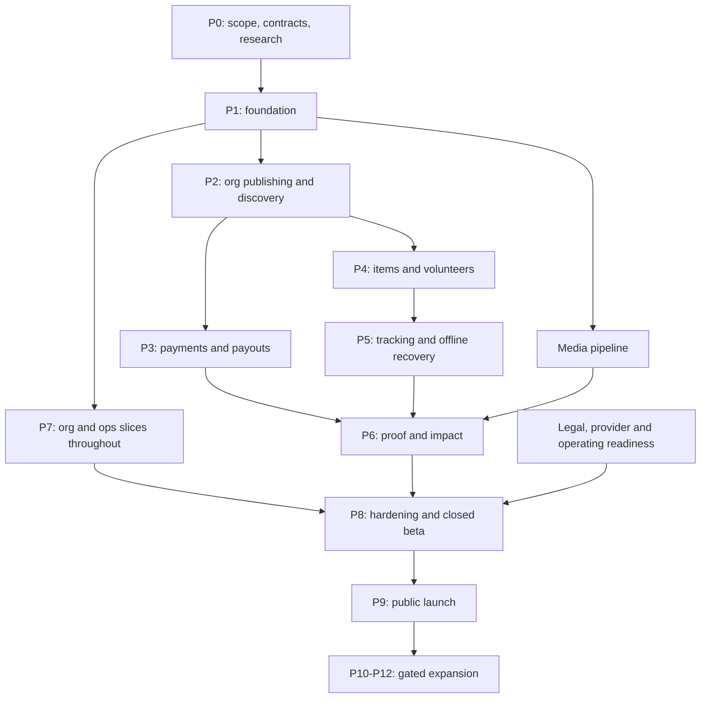

# NEKI — Complete phased delivery plan

**Prepared:** 8 September 2026  
**Scope:** Research and specification closure → complete Delhi NCR MVP → controlled launch → evidence-led expansion.  
**Status:** Proposed execution baseline. Founder decisions D1–D7 remain locked. Estimates, technical corrections, and new policies below are planning proposals until recorded in the relevant source document.  
**Outcome:** An organization can publish a quantified need; a person can contribute money, items, or time; NEKI can coordinate execution, show truthful progress, verify evidence, and issue an auditable impact record. Operations must be able to support the entire journey through the console.

**Navigation:** [Baseline and scope](#1-basis-current-state-and-how-to-use-this-plan) · [30 gaps](#3-audit-findings-that-must-be-resolved) · [Team and schedule](#4-staffing-estimates-schedule-and-dependencies) · [Phase 0](#5-phase-0--close-specification-gaps-and-prepare-execution) · [Phase 1](#6-phase-1--build-the-platform-and-design-foundation) · [Phase 2](#7-phase-2--organizations-missions-and-marketplace-discovery) · [Phase 3](#8-phase-3--money-contribution-payments-and-finance) · [Phase 4](#9-phase-4--items-volunteers-and-dispatch) · [Phase 5](#10-phase-5--realtime-tracking-and-offline-recovery) · [Phase 6](#11-phase-6--proof-verification-impact-ledger-and-account-completion) · [Phase 7](#12-phase-7--organization-and-operations-integration-track) · [Phase 8](#13-phase-8--hardening-release-readiness-and-closed-beta) · [Phase 9](#14-phase-9--open-beta-and-public-delhi-ncr-launch) · [Phase 10](#15-phase-10--improve-the-core-loop-and-validate-next-features) · [Phase 11](#16-phase-11--broader-platform-matching-and-multi-city-readiness) · [Phase 12](#17-phase-12--corporate-advanced-trust-and-long-term-platform) · [API/data checklist](#18-cross-cutting-api-data-and-background-work-checklist) · [Coverage](#19-requirement-screen-and-source-coverage) · [Quality and metrics](#20-quality-gates-metrics-and-observability) · [Test catalogue](#21-mandatory-adverse-case-test-catalogue) · [Risks](#22-risk-register-and-release-responses) · [Backlog](#23-backlog-organization-and-original-ticket-traceability) · [First three weeks](#24-first-three-weeks-execution-order) · [Completion](#25-completion-criteria-and-handoff-checklist).

## 1. Basis, current state, and how to use this plan

This plan follows a review of both original specifications, all seven numbered documents, both documentation indexes, all 18 ADRs, and the supplied visual board: **29 Markdown files and one image**. It expands the existing engineering plan rather than treating its tickets as completed work.

### 1.1 Source precedence

| Priority | Source | How it governs delivery |
|---|---|---|
| 1 | [Founder decisions](07-founder-decisions.md) | D1–D7 override earlier examples and defaults. |
| 2 | [PRD](01-prd.md) | MVP requirements, personas, scope, and success metrics. |
| 3 | [Accepted ADRs](adr/README.md) | Architecture baseline; unresolved deployment choices still need the specified spike. |
| 4 | [TDD](02-tdd.md), [data model](05-data-model.md), [flows](03-user-flows.md) | Technical and interaction contracts, subject to the corrections listed below. |
| 5 | [Design brief](04-design-brief.md) | Operational design tokens and component contracts. |
| 6 | [Original UX specification](../NEKI_Complete_UI_UX_Design_Specification.md), [master specification](../NEKI_Master_RND_Architecture_Documentation_Prompt.md), [visual board](../c0f5b185-e8b2-44fa-a0fe-626ee5f561a8.png) | Full experience, quality bar, research obligations, and long-term vision. Earlier wallet, city, and feature examples do not override MVP decisions. |
| 7 | [Existing engineering plan](06-eng-plan.md) | Original ticket IDs and effort estimates retained for traceability; sequence and timing refined here. |

Where two sources conflict, record the resolution and update the affected contract before coding that behavior. This document does not silently amend an accepted ADR or founder decision.

### 1.2 Verified repository state

**Execution refresh, 2026-09-10:** The current checkout root is `D:/Code/neki-app`, verified with `git rev-parse --show-toplevel`, at starting HEAD `816bc68` (`Add complete phased delivery plan (P0-P12)`). It has documentation and the reference board, no application scaffold, and was clean before execution changes. Use this current root for implementation commands. The macOS path and HEAD below describe the historical audit, not a required directory layout. See the [Phase 0 execution register](execution/phase-0.md) for current evidence.

- The application repository is the **nested** directory `/Users/naksh/Documents/nekiapp/nekiapp`, with its own Git history. The enclosing directory also has a separate, empty Git repository. Run implementation commands against the nested repository until repository ownership is deliberately clarified.
- Nested repository HEAD at audit: `04ea47b` (`added docs`); its working tree was clean before this plan was added.
- Current content is documentation, `.gitignore`, and the UI board. There is no current `app/`, `api/`, `web/`, test suite, infrastructure configuration, or runnable product.
- The original Flutter scaffold was removed. Do not equate historical commits with reusable current implementation.
- ADR-001 through ADR-018 already exist and are marked accepted. The old instruction to create all ADRs from scratch is stale. ADR-018 explicitly retains a deployment spike.
- There is no checked-in OpenAPI contract, R&D inspection report, standalone transition catalogue, design asset pack, or evidence of implemented acceptance checks.
- `.DS_Store` is not a tracked application asset. Handle housekeeping separately from product work; preserve source files and history.

### 1.3 Delivery terminology

- **Required:** Already required by the source documents or needed to make that requirement work end to end.
- **Proposed:** A concrete resolution or improvement added by this plan; the accountable owner records the final choice before dependent implementation.
- **Gate:** Evidence required to start dependent work or release a capability. A gate is not passed because its calendar week has arrived.
- **Work package:** A scope envelope to split into reviewable tickets, normally one to three engineer-days each. Large original tickets are not suitable as single coding tasks.
- **Future:** Preserved in the roadmap, with explicit entry conditions; excluded from MVP acceptance.

## 2. Product boundary and operating commitments

### 2.1 Locked MVP baseline

| ID | Commitment | Implementation consequence |
|---|---|---|
| D1 | No NEKI wallet or stored balance | Remove wallet from header, profile, navigation, and contribution flows. Provider-enabled wallet payment methods are a separate concept and may appear in provider checkout. |
| D2 | NEKI absorbs gateway fees for launch organizations | Store the fee policy and allocation snapshot; show actual economics in Contribute, Review, receipt, and Impact Record. Budget the subsidy. |
| D3 | Manual organization payouts | Build Finance-controlled payout records, contribution allocations, bank references, approval history, reconciliation, and reports. Route is future scope. Live funds require the documented legal sign-off. |
| D4 | Delhi NCR only | Explicit service-area boundary, serviceable pickup zones, launch content, local operations coverage, and out-of-area UX. A 50 km search radius does not expand pickup serviceability. |
| D5 | Razorpay | Server-created payment orders behind a provider interface; only approved account capabilities are displayed. |
| D6 | Flutter Web operations console | Every operational recovery action has an authorized, audited console workflow. |
| D7 | OTP + profile + volunteer application + ops approval | Browse before approval; booking and pickup assignment require current approval. Enhanced manual checks for higher-risk work. Government-ID/KYC remains post-MVP. |

The source phrase “identity verification Phase 4+” is ambiguous against the engineering phase numbering. This plan interprets it according to D7's explicit MVP exclusion: **no government-ID/KYC in the MVP volunteering phase**.

### 2.2 Surfaces that must ship together

| Surface | Complete MVP responsibilities |
|---|---|
| Consumer iOS/Android app | OTP onboarding, location, Home, Explore, search, categories, mission and organization detail, money/items/time, skills interest, tracking, Activity, verified records, profile, bookmarks, notifications, support, privacy and deletion. |
| Volunteer capability in the same app | Application and approval status, slot booking/waitlist, assignment details, check-in/out, assigned pickups, navigation, foreground tracking, proof capture, offline action queue, verified hours. |
| Organization Flutter Web portal | Apply and upload documents, dashboard, profile, mission editor/moderation feedback, contribution list, volunteer roster, attendance, shipment acknowledgement, updates, proof submission and rework, impact. |
| Ops/Finance Flutter Web console | Dashboard, organizations, missions, contributors, volunteer approval, contributions, payouts, dispatch, proof, verification, disputes/refunds, fraud review, reports, health, audit history. |
| Backend and workers | Domain rules, authorization, durable events, payment reconciliation, media processing, notifications, tracking snapshots, search, impact materialization, retention and administrative recovery. |
| Supporting public web endpoints | Mission/organization link fallback and share metadata, app association files, privacy/terms/help/deletion pages. This is minimal launch support, not the later SEO marketplace. |

### 2.3 Explicit scope classifications

| Tier | Included |
|---|---|
| NOW | Close contradictions; validate dependencies; finish contracts, design handoff, operating policies, and backlog. |
| MVP | All 17 PRD requirements, with certificate metadata and skills interest capture; one city; volunteer-operated pickups; manual payouts. |
| NEXT | Neki Drives, Give Anything, full skills matching, PDF certificates, recurring contributions, better organization/volunteer mobile tools, courier integration, settlement automation, second city after readiness. |
| LATER | Corporate CSR/program tools, budgets, employee volunteering, surplus, multi-user roles, richer public pages/SEO, Hindi and additional languages. |
| EXPERIMENTAL | Wallet/credits, impact scoring, ML ranking, advanced matching, enterprise operating-system positioning. Each requires validation and its own decision record. |

Do not create empty production modules for future capabilities solely because they appear in a diagram. Retain extension points where useful, and explicitly label any reserved schema fields.

## 3. Audit findings that must be resolved

Each item has a deadline relative to dependent work. These are design tasks, not assertions that current code contains bugs: current code does not exist.

| ID | Finding and source | Resolution or required decision | Owner / deadline |
|---|---|---|---|
| G01 | Engineering plan and indexes still say ADRs must be written. | Mark existing ADR creation as complete; verify their evidence, decisions, and links. Do not repeat documentation work. | Tech lead / P0 |
| G02 | Outer and nested Git repositories can lead work into the wrong history. | Verify the active checkout root rather than assuming the historical macOS layout; record evidence before scaffolding. Do not remove repositories automatically. | Tech lead / P0 |
| G03 | Existing numbered estimates total **84.5 person-weeks**, before unestimated design/founder work and newly found gaps. | Re-estimate work by role and use the capacity-based schedule in §4. | Product + tech lead / P0 |
| G04 | R&D report is absent; ADRs contain comparison claims without checked-in evidence. | Inspect all eight named repositories, record commits/licenses/findings; qualify unsupported comparative claims. | Tech lead / P0 |
| G05 | TDD endpoint inventory lacks the later volunteer application and payout workflows. Other gaps include issues/support, skills interest, corrections, rescheduling, bank-detail changes, and document rework. | Produce a complete OpenAPI operation matrix before building clients; §18 lists families. | Backend lead / P0 |
| G06 | Original volunteer flow skips ops approval; sample discovery mentions Pune despite Delhi-only launch. | Insert application/status/reapplication/approval gates into F3/F9; use Delhi NCR fixtures for launch journeys. | Product + design / P0 |
| G07 | Some sources imply certificate PDFs at launch; scope ladder defers PDFs. | Ship certificate metadata/detail only; omit unavailable download actions; verified hours remain mandatory. Tax/payment receipts are separate. | Product / P0 |
| G08 | Skills interest is required but the contribution schema requires a mission/need. | Proposed: separate `skill_interests` object with optional mission context; no fabricated completed contribution or impact record. Define view/update/delete and consent. | Product + backend / P0 |
| G09 | Proposed payout uniqueness predicate depends on a parent payout's status. | A partial index is limited to columns of its indexed table. Design a same-table allocation constraint or transactionally locked settlement-allocation ledger; test concurrent approvals and payments. See [PostgreSQL partial-index documentation](https://www.postgresql.org/docs/16/indexes-partial.html). | Backend + Finance / before P3 |
| G10 | “CAPTURED minus REFUNDED minus PAID payouts” can miscount once statuses change to SETTLED/RECONCILED; partial refunds and subsidy are underspecified. | Use durable monetary facts and allocation entries, not current status membership. Define captures, refunds, mission allocation, fee subsidy, gateway settlement, organization payouts, refund reserves, reversals, and recovery separately. | Finance + backend / before P3 |
| G11 | One payment per contribution conflicts with retries/multiple provider attempts; expiry may race late capture. | Define contribution/payment/order/attempt relationships, allowed retries, late-success handling, reservation release, and cancellation recovery. Keep unresolved attempts visible and reconcilable. | Backend / P0 design, P3 proof |
| G12 | Provider order creation cannot be atomic with a local database transaction. | Persist intent; use a recoverable orchestration state and provider lookup/reconciliation for uncertain outcomes; never assume a DB rollback cancels an external order. | Backend / before P3 |
| G13 | Outbox ordering is stated but `SKIP LOCKED` alone is not an aggregate-ordering design. | Specify aggregate sequence, worker ownership/locking, poison-event behavior, atomic handler receipts, and crash recovery. External effects need their own dedupe/reconciliation. | Backend / P0–P1 |
| G14 | Mission ACTIVE/READY, paused resume, shipment side states, proof rejection/rework, and reminders are ambiguous. | Author complete actor/guard/transition/effect tables. Decide whether reminder/delay is a status or orthogonal metadata; retain explicit resume state. | Backend + ops / P0 |
| G15 | Generic “fully funded” CTA can block item/time needs that remain open. | Derive availability per need/contribution type. Only disable money when its need closes; retain other eligible actions. Define overfill and mixed-need completion policy. | Product + backend / P0 |
| G16 | Payout marker “Received by organization” may otherwise appear at capture. | Tie that milestone to evidenced organization payment/acknowledgement; distinguish provider settlement from payout and mission execution. | Finance + product / before P3 |
| G17 | Impact creation is described both as pending at capture and immutable after completion. | Pending Activity uses contribution projections; final append-only record is issued only after verified completion. Corrections are separate events/views. | Backend / P0 |
| G18 | Beneficiary totals can be multiplied across contributors or repeated contributions to one mission. | Define attribution and deduplication. Proposed: user supported-mission counts dedupe by mission; show verified mission-reported beneficiaries with contextual wording, never claim globally unique people without evidence. | Product + ops / before P6 |
| G19 | Hash chain includes fields later anonymized and lacks concurrent append rules. | Define canonical immutable payload, sequence/locking, separate mutable identity projection, correction-chain integrity, and external integrity checkpoints. | Backend + privacy / before P6 |
| G20 | R2 “object versioning” is assumed in ADR-009/TDD. | Cloudflare lists S3 versioning APIs as unimplemented. R2 bucket locks are a separate supported capability. Design immutable object keys, restricted writes, retention/backup and integrity checks; validate chosen controls and correct the ADR. See [R2 S3 compatibility](https://developers.cloudflare.com/r2/api/s3/api/) and [bucket locks](https://developers.cloudflare.com/r2/buckets/bucket-locks/). | Infrastructure + backend / P0–P1 |
| G21 | Media retention conflicts with blanket account deletion; immutable proof and later redaction also interact. | Produce a data-class policy: removable personal copies, retained audit/financial records, anonymization, legal holds, revocation of access, redacted derivatives, and deletion propagation. Document owners and exceptions. | Privacy/legal + ops / P0 policy, before P8 drill |
| G22 | Monthly ping partitions alone do not enforce a strict 30-day maximum; exact locations also exist in shipment rows, events, proofs, caches, and devices. | Define every location-bearing store, expiry action and retention basis. Use daily partitions or row cleanup where needed; separately justify restricted proof metadata. | Backend + privacy / P0–P5 |
| G23 | Contributor location precision differs: ~50 m in PRD, three decimals/~100 m in TDD. | Choose one disclosure policy and implementation, with serialization tests. Proposed baseline: three-decimal rounding for active contributor tracking, explicitly approximate; no precise route/origin leakage. | Privacy + product / before P5 |
| G24 | Blanket private media rules conflict with org uploaders reviewing their own documents; proofs may expose other contributors' homes. | Build per-purpose/per-role access rules. Org can view its own submission; unrelated orgs cannot. Redact proof views; restrict home photos/addresses beyond generic mission membership. | Security + ops / before P2 |
| G25 | Ops intervention lacks a precise role matrix; local biometric is not server-verifiable step-up. | Define role and reason per action, server-verified reauthentication for sensitive changes, Finance separation and revocation handling. No unrestricted status dropdown. | Security + Finance / P0–P1 |
| G26 | Search contract covers org/category/tags but illustrative tsvector contains title/summary/story only. “No monetary input” conflicts with amount-based availability if interpreted literally. | Complete index/read-model fields; define no donor-spend/payment-for-placement bias. Use normalized need availability only if explicitly approved. | Product + backend / before P2 |
| G27 | Per-city shared Home cache could leak personalized modules. | Separate public feed modules from owner-scoped active-contribution/user modules; scope caches and invalidation explicitly. | Backend / P1–P2 |
| G28 | No confirmed providers, quotas, software compatibility, region guarantees, or live accounts. | Spike pinned versions, Flutter plugins/web capabilities, database extensions, Redis command/pubsub behavior, storage location/retention, Maps terms/caching, SMS, checkout, deployment. Do not assume legacy document versions are current recommendations. | Tech lead / P0–P1 |
| G29 | Terms, consent records, disputes, target-change requests, proof resubmissions, fee-policy revisions, food expiry, age eligibility and approval history lack complete schema. | Add explicit schema/API decisions and retention rules; avoid storing operational history only in freeform notes. | Backend + product / P0 |
| G30 | Full shell/featured card may not fit first viewport at all text sizes. | Validate 390×844 composition; prioritize accessibility/reflow over forcing every module into the first viewport. | Designer / P0–P2 |

## 4. Staffing, estimates, schedule, and dependencies

### 4.1 Working team assumption

| Role | Allocation | Main ownership |
|---|---|---|
| Tech lead / backend engineer A | 1 full-time | Architecture, payments, Finance invariants, security, infrastructure decisions and reviews. |
| Backend engineer B | 1 full-time | Catalogue, organizations, missions, logistics, media, verification, workers, admin APIs. |
| Flutter engineer A | 1 full-time | Consumer app and volunteer capability. |
| Flutter engineer B | 1 full-time | Shared design system, consumer overflow, organization portal, ops console. |
| Product designer | 1 full-time during core design, then scheduled QA capacity | Tokens, components, full screen states, prototypes, asset handoff, usability. |
| Founder / product / ops lead | Explicit weekly allocation throughout | Scope, partners, policies, legal coordination, launch operations. |
| QA | 0.5 from foundation; proposed increase to 1.0 during integration/hardening | Acceptance suites, devices, fault injection, release evidence. |
| Finance + legal/privacy advisor | Named people, scheduled review slots | Money flow, payout controls, receipts, retention, operational approval. |
| Infrastructure/security specialist | Part-time scheduled support or explicit tech-lead capacity | Deployment, recovery drills, external security assessment. |

Do not count the Flutter web engineer twice during overlapping phases. If this becomes a solo/AI-assisted build, re-estimate calendar time; the team schedule below does not transfer automatically.

### 4.2 Why the schedule changes

The 62 numerically estimated original tickets total **84.5 person-weeks**: API 30.5; APP 30.5; WEB 11; DOC 3; INF 4; QA 3; SEC 1.5; REL 1. Designer and founder tickets are additional. These are source estimates, not measured delivery rates.

The API/APP/WEB/DOC/INF/REL subtotal is **80 person-weeks**. Four engineers over 20 weeks provide 80 gross weeks: effectively no allowance for reviews, meetings, leave, integration, defects, or added gaps. At a proposed 70–75% planned feature capacity, that subtotal alone needs about **27–29 calendar weeks**, before role bottlenecks and additional scope.

Use **week 32 closed beta / week 36 public launch** as a planning baseline, with a preliminary range of **30–36 weeks to closed beta and 34–40 weeks to public launch**. Reforecast after P0 and after each two-week sprint. These are estimates, not launch commitments; dependencies and review lead times control the actual dates.

### 4.3 Phase calendar

| Phase | Baseline window | Outcome / gate |
|---|---|---|
| P0 — Specification, research, decisions | W1–3 | Contracts, scope, operating rules, designs and executable backlog ready. |
| P1 — Platform and design foundation | W4–7 | Signup, sessions, location, app shell and portal shell on staging. |
| P2 — Organizations, missions, marketplace | W8–11 | Org publishes through moderation; consumer discovers real API-backed missions. |
| P3 — Money, payments, Finance | W12–16 | Sandbox contribution → capture → receipt → payout record → reconciliation/refund. |
| P4 — Items, volunteers, dispatch | W17–21 | Approved volunteer executes an item pickup and a booked mission with recovery paths. |
| P5 — Realtime, maps, offline recovery | W21–24 | Honest live tracking, stale state, polling fallback and reliable field sync. |
| P6 — Proof, verification, impact, account completion | W24–27 | Evidence review → immutable record → correct personal history and stats. |
| P7 — Organization/ops integration track | W6–28, allocated slices | Every phase ships its own operational controls; final cross-role rehearsal passes. |
| P8 — Hardening and closed beta | W28–32 | Release evidence, production readiness, then capped Delhi NCR pilot. |
| P9 — Open beta and public launch | W33–36 | Controlled expansion with operating and product metrics. |
| P10 — Core-loop improvements and NEXT discovery | Launch +1–3 months | Retention/operations improvements and selected follow-on pilots. |
| P11 — Broader platform and multi-city | Launch +3–6 months, conditional | Validated campaigns/matching/organization tools and second-city readiness. |
| P12 — Corporate and long-term expansion | Launch +6–18 months, conditional | Corporate pilots, advanced trust, multilingual/product expansion. |

P7 is **not an additional full-time engineer** or a second serial phase after P6. Its effort is embedded in P1–P6 and the W28 integration gate. P4/P5 and P5/P6 overlap only on independent, contract-stable work. Reassigning an engineer moves dependent dates.

### 4.4 Dependency map



There are four critical paths: financial correctness; physical fulfilment; evidence-to-impact; and operational readiness. A polished consumer app cannot compensate for an incomplete path.

### 4.5 Budget and operating capacity work

During P0, build a budget from actual vendor quotes and team costs. No provider pricing is assumed here. Model development/staging/production separately; include compute, workers, Postgres/PITR, Redis, storage growth and backup, image/video processing, SMS, Maps calls, push infrastructure, monitoring, CI/macOS runners, store accounts, security assessment, legal/Finance, support, pickup expense and gateway-fee subsidy.

Use editable scenario inputs: active users, OTPs/login, checkout attempts, captured volume, average contribution, fee subsidy, pickups/day, proof bytes/mission, retention years, concurrent trackers and support cases. Track cost per verified mission, pickup, contribution, and active organization. Model cash timing separately from accounting liability: NEKI may owe the mission the full contribution while provider fees reduce cash received.

Proposed review capacity formula: `reviews/day × average minutes/review ÷ productive minutes/reviewer/day`, plus a buffer for rework and escalations. Size dispatch and support similarly. Fund and staff the pilot caps before enabling them.

## 5. Phase 0 — Close specification gaps and prepare execution

**Window:** W1–3. **Owner:** Tech lead + founder. **Entry:** Source review complete. **Goal:** Engineering can implement without inventing domain rules, and all external work has an owner.

### P0.1 Product and policy closure

1. Confirm source precedence and locked MVP boundary; map every FR-01…FR-17 to a delivery phase and acceptance journey.
2. Resolve G01–G08, G14–G15, G17 and G29 at specification level; assign the remaining technical spikes.
3. Define quantified mission needs, partial fulfilment, overfill, funding reservations, target-change approvals, expiry, cancellation and organization-suspension behavior.
4. Define volunteer eligibility/application rework, booking and cancellation cutoffs, waitlist promotion, enhanced manual checks, no-shows and suspension while assigned.
5. Define serviceable zones, pickup slots, dispatch capacity, donor/volunteer contact consent, late pickups, failed deliveries, drop-off acknowledgement, and issue escalation.
6. Define verification responsibilities, acceptable evidence, missing metadata treatment, rework, rejection, appeal, corrections, attribution and certificate metadata.
7. Record refund decision policy, payout cadence, reserves and approval thresholds, bank-detail change verification, supporting evidence, and payout failure/reversal handling.
8. Set receipt policy with the advisor: payment acknowledgement versus organization-issued eligible tax documentation. Do not assert NEKI's legal role solely from a draft PRD.
9. Define ToS/privacy/SOP consent versioning, age-attestation method with minimum data, reporting/moderation policy, deletion and retention exceptions.
10. Define the exact minimal help/report-issue workflow and accountable support queue; avoid launching a support button with no staffed destination.

### P0.2 Technical contracts

- Produce transition tables for mission, contribution by type, payment attempts/refunds, payout, shipment, assignment, volunteer application, organization review, proof review and impact correction.
- Every transition specifies actor, preconditions, allowed prior versions, required evidence/reason, transactional changes, domain event, user-facing copy, notifications and failure code.
- Complete schema gaps from §3. Define relational integrity for polymorphic proof subjects, media associations, organization addresses and scoped roles; include uniqueness when `organization_id` is null.
- Define typed events with event ID, type/version, aggregate ID/sequence, timestamp, correlation/causation IDs and minimal payload. Specify retries, handler receipts, DLQ and recovery.
- Produce OpenAPI v1 schemas and error examples for all endpoint families in §18. Specify principal scope, public/private response shape, pagination, idempotency, rate limits and compatibility.
- Choose one contract-authoring workflow: reviewed contract-first draft, then FastAPI export becomes canonical with automated generated-client drift checks. Avoid two manually maintained contracts.
- Produce permission matrix: contributor, approved/unapproved/suspended volunteer, org admin, ops agent, ops lead, Finance and super admin, including anonymous reads and field-level media/location rules.
- Specify money/fees/counters precisely, and define idempotency scope `(principal, operation, key)` plus request hash, in-flight behavior and retention. Financial provider references remain durable beyond 24-hour response caching.
- Define server timestamp versus reported capture/action time and acceptable clock skew. Delhi slots/quiet hours use `Asia/Kolkata`; storage is UTC.

### P0.3 Research and provider validation

Create `docs/rnd/open-source-review.md`. Inspect the eight repositories named in the master specification: `parrottkim/flutter_riverpod_clean_architecture`, `guilherme-v/flutter-clean-architecture-example`, `Uuttssaavv/flutter-clean-architecture-riverpod`, `MohammadFayyad/flutter-ecommerce-app`, `Sameera-Perera/Flutter-TDD-Clean-Architecture-E-Commerce-App`, `mahmoodhamdi/TStore`, `kforjan/delivery-app`, and `patriciaperez90/flutter-food-delivery-app-clone`.

For each, record URL, inspected commit/date, license and obligations, project structure, dependencies, state/navigation/networking patterns, caching, offline/realtime/tracking behavior, tests, useful concepts and rejected concepts. Mark unavailable information explicitly. The missing R&D report is **not completed by this planning exercise**; no license findings are invented here.

Run bounded compatibility spikes for Flutter/Riverpod/codegen/Drift/web, Razorpay mobile flow, SMS integration, map proxy and restrictions, private media uploads/processing, managed database extensions, Redis pub/sub/queue compatibility, and deployment. Record pinned versions and upgrade policy; revisit an ADR only when the evidence justifies it.

Start external onboarding in W1: payment account and approved methods, SMS/DLT and fallback arrangements, Apple/Google developer accounts, domain ownership, Maps billing/restricted keys, storage/observability/hosting accounts. Founder schedules advisor review and starts onboarding five potential Delhi partners, targeting three approved launch organizations. No messages or purchases are performed as part of this plan.

### P0.4 Design and handoff

- Create full route/screen inventory and state matrix, including volunteer application, Finance, proof rework, support and unavailable states missing from the reference board.
- Produce Figma variables and token specification for light/dark themes, Instrument Serif/Inter direction, spacing/radius/elevation, semantic colors and restrained motion. Check actual contrast rather than trusting example ratios.
- Prototype Journeys A–D plus org publish, ops proof review, payout approval, and volunteer pickup recovery. Conduct a small formative test with representatives of contributor, volunteer, org and ops roles; log usability findings and changes.
- Prepare component states and responsive layouts at 320, 360 and 390/412 px, 200% text, and desktop/tablet portals. Design keyboard/focus behavior and safe areas.
- Create asset inventory: butterfly/wordmark, app icons, category icons, illustrations, launch photography, map style, share cards, animation fallbacks; record licensing and consent provenance.
- Separate illustration from real evidence in both design and storage contracts. No source-board image is treated as real mission proof or licensed launch photography.

### P0.5 Deliverables and gate

Deliver: scope/decision register; R&D report; provider/version spike notes; complete transition and event catalogues; OpenAPI/error examples; revised schema; authorization matrix; screen/state inventory and prototypes; asset plan; operating policy drafts; staffing/cost model; prioritized tickets with dependencies.

**Exit evidence:** Every MVP behavior has a contract owner and acceptance case; architecture contradictions that block foundation are resolved; accepted ADRs are reconciled; Phase 1 backlog is sized; provider/legal work has named owners and dates. Production feature coding starts after this gate. Future domain-specific gates remain explicit rather than pretending all live-funds approvals already exist.

**Original tickets:** NK-DOC-1…5, NK-DES-1…2. NK-DOC-1 is validation/amendment of existing ADRs, not recreation.

## 6. Phase 1 — Build the platform and design foundation

**Window:** W4–7. **Owner:** Tech lead + Flutter leads. **Entry:** P0 foundation gate. **Goal:** A real user can authenticate and reach an API-backed staging shell; teams share the same contracts and operational infrastructure.

### P1.1 Repository and developer workflow

Create the monorepo structure inside the confirmed application repository:

```text
api/                         FastAPI application, workers, migrations, tests
app/                         Consumer Flutter app and volunteer capability
web/                         Organization and operations Flutter Web surfaces
packages/neki_design_system/ Shared tokens, components and examples
packages/neki_api_client/    Generated Dart client
infra/                       IaC, environment and deployment configuration
tools/                       OpenAPI export, codegen, fixtures, operational scripts
docs/                        Specifications, decisions, runbooks and evidence
```

Pin runtimes and dependencies after spikes; establish formatter/linter/import-boundary rules, test commands, fixtures and a bootstrap README. Local compose supplies Postgres/PostGIS, compatible Redis, object-store emulator and scanner. Test actual cloud storage semantics on staging as well; the emulator is not proof of compatibility.

### P1.2 Backend foundation

- FastAPI factory, configuration validation, DB sessions, transactions, Alembic, connection pooling, request IDs, standard error conversion, health/readiness endpoints and graceful shutdown.
- Roles and principal-scoped policies; consistent anonymous reads and authenticated writes; suspension and revocation evaluated server-side rather than trusting old claims indefinitely.
- OTP request/verify, hashing, expiry, resend/attempt limits, phone/IP/device abuse controls and deterministic test provider restricted to nonproduction.
- Short-lived access tokens and rotating refresh-token families, reuse detection, logout/revoke, device registration and recovery from refresh races.
- Web refresh sessions in secure HTTP-only cookies with explicit CORS/CSRF rules; mobile credentials in platform secure storage. Define browser access-token handling.
- `/me`, profile update, basic privacy/preferences, addresses, selected location, device push-token registration, and consent capture.
- Idempotency middleware/storage, cursor pagination, ETag/delta primitives, shared validation and UTC/INR representations.
- Durable outbox, ordered processing, handler receipt transaction, retries, DLQ, replay authorization, metrics and stale-job watchdog. Test a crash before/after handler commit.
- Categories/subcategories/synonyms/item types, Delhi service polygon, notification templates, feature flags and safe staging fixtures.
- Geo adapter with restrictions/caching from the provider spike; no user-selected area should grant pickup serviceability on its own.

### P1.3 Flutter foundation

- Bootstrap/session restoration, Riverpod feature controllers, repository interfaces, generated client, Dio interceptors and serialized refresh.
- Five-tab state-preserving shell: Home, Explore, Contribute, Activity, Profile. Auth/onboarding redirects retain intended destination; malformed/private deep links fail safely.
- Drift cache migrations, owner-scoped cache keys, token separation, draft and local-action queue foundation. Logout/account switch clears private caches and queued work appropriately.
- Shared tokens/components: button, chip, segmented control, form fields, amount/search/address inputs, nav/top bar, sheets/dialogs, skeleton, empty/error state, toast, avatar, cards and verification/status primitives.
- Light/dark theme, externalized strings, Indian currency grouping, pluralization, local dates, text scaling, semantics, keyboard handling and reduced motion.
- Splash, Welcome, Phone, OTP, Name, permission rationales and manual location selection; notification permission is skippable.
- Typed analytics wrapper, privacy allowlist, crash/performance reporting, server-authoritative feature flags and environment separation.

### P1.4 Staging, CI and early web slice

Provision staging with Terraform and managed secrets; isolate test/live credentials and buckets. Add lint/type checks, domain/controller tests, database integration, API contract validation, client codegen diff, basic goldens, secret/dependency/container scans, Android/iOS/web build smoke checks.

Deploy staging on reviewed merges; document future production tag/approval workflow. Add organization/ops login shells, role-protected navigation, basic audit viewer and health/DLQ read views. Use named internal operator identities; no shared admin account.

### P1 acceptance and gate

1. New phone signup reaches the staging Home shell; existing user restores a session; denied permissions still permit manual location and discovery.
2. OTP limits and refresh reuse are enforced on the server; cross-user and cross-org requests are denied.
3. Offline cached shell works for an existing user without granting offline financial authorization; another user cannot see its data.
4. Generated client compiles against exported OpenAPI; clean checkout bootstrap/build succeeds.
5. A replayed event produces one database effect; worker crash/restart loses no persisted event; logs connect app request ID to backend trace without PII.
6. Portal role guards, keyboard focus and logout work on staging.

**Original tickets:** NK-INF-1…3; NK-API-1…6; NK-APP-1…5; early NK-WEB-1 and NK-API-23.

## 7. Phase 2 — Organizations, missions and marketplace discovery

**Window:** W8–11. **Owner:** Backend B + consumer/web engineers. **Entry:** Identity, policies, catalogue and shared UI stable. **Goal:** Organizations supply missions through real review flows, and contributors discover them through the production-shaped API.

### P2.1 Organization supply and moderation

- Build application/profile/document upload with clear submitted, needs-info, rejected, verified, suspended and expired states.
- Add ops organization review checklist, reviewer decisions, expiry/probation, audit history and notification. A user can apply before acquiring `org_admin`; scope is established securely by the backend.
- Add mission draft/editor with title/story/category, mission location, deadline, images, quantified money/item/volunteer needs, slots, proof requirements, serviceability, drop-off, partial fulfilment and fee policy.
- Support draft save/reopen, validation by section, review submission, moderation preview, needs-info feedback and resubmission. Unverified orgs cannot publish.
- Lock target changes after contributions exist; use explicit change-request/ops approval with before/after history. Restrict significant location/deadline changes and notify affected participants.
- Implement status transitions, actor guards, history, domain events, expiry scheduler, visibility and public/private serialization.

### P2.2 Media foundation

- Issue purpose-scoped upload URLs with ownership, MIME/size limits, expiry and permitted object key. Validate actual uploaded bytes at completion, not only declared headers.
- Process image, document and proof-video types separately; scan, quarantine, image metadata extraction/stripping, thumbnails/WebP/BlurHash, hashing and rejection reasons.
- Implement retryable processing, duplicate completion handling, abandoned-upload cleanup, derivative regeneration and storage-cost/queue metrics.
- Keep public mission imagery separated from private items, documents, avatars and proof; test access by purpose and role. Private storage must not become public through bucket/CDN configuration.
- Apply illustration tags, provenance, protected proof capture metadata, consent fields and future proof-processing hooks. Add redaction/blur workflow before proof is exposed to contributors.

### P2.3 Discovery and mission experience

- Build data-driven categories/subcategories and “See All”; no dedicated hard-coded widget per cause.
- Compose Home from independently failing modules with cache/stale states: categories, highlight, nearby, urgent, picks, weekend volunteering, recently completed and organizations; reserve active-contribution priority for P3 onward.
- Build Explore filters, selected filter count/reset, cursor pagination, deterministic sort, missing-image/content fallbacks and empty service-area state.
- Build debounced search, recent/clear history, typo tolerance, synonyms, “near me” parsing and grouped mission/organization/category results. Keep raw query collection scoped and retained only under the approved analytics/privacy policy.
- Implement mission detail hierarchy, progress per need, requirements, org card, precise verification explanations, updates, sticky eligible actions, bookmark and sharing.
- Implement public organization view and its missions without documents, donor PII or internal notes.
- Add native mission sharing, public link metadata/fallback, app association files, installed/uninstalled and logged-in/logged-out deep-link handling.
- Provide Contribute-tab mission selection and skills-interest entry. Clearly explain interest capture without promising matching or a completed contribution.

### P2 acceptance and gate

1. Org applies → ops verifies → org creates mission → ops publishes → consumer finds it. No SQL edits or hard-coded live missions.
2. Search/category/filter combinations work with cursor pagination and deterministic ties; concurrent publication does not corrupt pagination.
3. Fully funded money does not close available volunteer/item actions; expired/paused/unavailable states show truthful explanations.
4. Failed media upload/review resubmission is recoverable; another org cannot fetch private documents or upload into that org's namespace.
5. Home module failure preserves working modules; cached data is labelled and private modules cannot leak through shared caches.
6. Mission link opens the correct screen through authentication; browser fallback and preview expose public information only.
7. Design QA passes at reference width and small screens, dark mode and increased text; query/profile measurements meet the relevant budgets in §20.

**Original tickets:** NK-API-7…11; NK-APP-6…11; first operational slices of NK-WEB-2…3 and NK-API-23. Added scope: skills interest contract, public link support and explicit moderation/target-change recovery.

## 8. Phase 3 — Money contribution, payments and Finance

**Window:** W12–16. **Owner:** Tech lead + Finance + consumer/web engineers. **Entry:** Missions, monetary contracts and provider test account ready. **Goal:** Correct and supportable money movement in sandbox, including every uncertain outcome.

### P3.1 Money model and checkout

1. Implement contribution amount validation in integer paise: default minimum ₹10, configurable upper limits and pilot caps. Derive payable amount and mission eligibility on the server.
2. Snapshot contribution amount, fee policy/version, disclosed mission allocation and subsidy; distinguish quoted fee from later provider-reported actual fee where necessary.
3. Implement concurrent remaining-need reservation/overfill policy, expiry release, deadline checks and final eligibility validation. Never silently allocate captured money to another mission.
4. Persist contribution/payment intent before contacting the provider; implement uncertain-order recovery and attempt history under stable provider references.
5. Build amount presets/custom amount, eligible type tabs, fee line, anonymous display choice, moderated message, Review and provider checkout.
6. Resolve when anonymous/message edits persist if an order is created before Review, as shown in F1. Prefer an explicit reviewed submission contract; preserve immutable financial fields once checkout begins.
7. Implement immediate button loading and stable idempotency key per logical attempt; a timeout is pending, not permission to create a second charge.

### P3.2 Verification, webhooks and reconciliation

- Validate provider signatures on raw request bytes, dedupe webhook events, persist receipt before acknowledging, and process recoverably. Validate account, order, payment ID, currency and amount.
- Client callback only initiates server verification/status fetch. Success requires server-confirmed capture; neither checkout UI nor an unverified callback writes payment success.
- Handle duplicate, delayed and out-of-order webhook events; prevent state regression. Razorpay explicitly documents duplicate-event identification and non-guaranteed delivery order in its [webhook validation guidance](https://razorpay.com/docs/webhooks/validate-test/).
- Reconcile unresolved orders/payments on the documented schedule, plus stale captured/refund/settlement cases. Local expiry does not prove the provider cannot capture later.
- Build Confirming, still-pending, known-failed, cancelled and recovered-success UX; app relaunch finds pending contributions. Retry only when previous attempt disposition is understood.
- Create payment acknowledgement/receipt numbering, authorized download/view and allocation block; organization-issued eligible tax receipt is a distinct artifact subject to the approved policy.
- Update mission financial projections from durable facts, compare with nightly recomputation and surface drift as a Finance case.

### P3.3 Manual payout workflow

- Build eligible payable contribution selection by organization/mission, reserves/exclusions, draft totals, linked allocations and recipient snapshot.
- Implement DRAFT → APPROVED → PAID → RECONCILED, with cancellation where allowed and a documented exception path for failed/returned transfer. Record bank value date, reference/UTR, recipient, operator, notes and evidence.
- Finance approval required; two distinct people for amounts above ₹50,000. Prevent self-approval where the policy requires separation; detect artificial batch splitting and changed bank details.
- Reserve allocations against concurrent payout drafts/approvals; enforce no overpayment across statuses including RECONCILED. Revalidate before marking paid.
- Manual bank execution remains an operator action outside NEKI's payment abstraction in MVP; NEKI records and verifies evidence. Never mark a transfer paid solely because someone clicked an unguarded status control.
- Outstanding liability/report derives from mission allocations, completed refunds, paid/reconciled payouts and adjustments. Display gateway subsidy and provider settlements separately.
- Implement organization statements, payout detail, CSV export, audit history, reconciliation variance and overdue-liability queues.

### P3.4 Refunds, disputes and exceptions

- Build full/partial refund requests with reason, authorization, idempotent provider invocation, final webhook/fetch confirmation and failure retry.
- Never refund more than captured net refundable balance; reserve in-progress refunds and prevent simultaneous payout against the same amount.
- Handle refunds before payout, after payout, after mission cancellation, after late capture and after completed impact. After-payout refunds create explicit recovery/negative-balance cases rather than rewriting history.
- Add dispute/support case record linked to contribution/payment, attachments, owner, timeline and resolution; route provider dispute/chargeback cases into Finance even if some handling remains manual.
- Money tracking: payment confirmed → organization receipt milestone with evidence → organization execution update → proof → verification. Do not equate capture with NGO receipt or verified impact.
- Notifications/in-app center and active-contribution Home module support pending/success/refund/account cases; dedupe, preferences, quiet hours, deep links and push-token cleanup.

### P3 acceptance and gate

Demonstrate in sandbox: success, known failure, user cancel, double tap, identical retry, changed-body same key, provider timeout, lost callback, delayed/duplicate/out-of-order webhook, kill app mid-checkout, late capture after local expiry, fully funded race, cancellation, partial/full refund, duplicate refund, payout allocation race, returned transfer and reconciliation mismatch.

For every case, show the user screen, authoritative monetary records, audit history, operational recovery action and notification behavior. Verify no duplicate charge attributable to NEKI retry logic, no duplicated allocation, no false failure/success, no payment double counting and no exposure of private payment data. Sandbox monetary balances reconcile exactly; explain any intentional reserved balance.

**Gate:** Financial invariants and end-to-end sandbox evidence accepted by tech lead and Finance. This does **not** enable live funds; that gate remains in P8.

**Original tickets:** NK-API-12…15, NK-API-24; NK-APP-12…14; NK-QA-1; Finance portions of NK-WEB-3/NK-API-23.

## 9. Phase 4 — Items, volunteers and dispatch

**Window:** W17–21. **Owner:** Backend B + Flutter engineers + ops. **Entry:** Mission needs, media, applications/eligibility contracts and operations shell. **Goal:** Goods and volunteer time can be committed, coordinated and completed with accountable recovery.

### P4.1 Volunteer application and eligibility

- Build application form: service area, availability, skills, vehicle capability, SOP consent and required eligibility attestation. Collect only information needed for the approved policy.
- Support pending, needs-info, approved, rejected and suspended states with clear next actions and ops review history. Reapplication preserves previous decisions.
- Guard all slot bookings and pickup assignments with current approval; an old role claim is insufficient after suspension. Browsing remains available.
- Add enhanced-check queue/status for higher-risk missions. Approval of general volunteering does not automatically clear every enhanced-check assignment.
- Define suspension/rejection consequences for existing assignments: notify ops, replace or cancel safely, revoke address/location access and preserve history.

### P4.2 Time contribution and attendance

- Mission volunteer sheet: role, requirements, date, start/end, capacity, organizer/location, duration and cancellation terms.
- Transactionally reserve capacity; enforce duplicate booking and overlapping-assignment policy; update remaining slots and waitlist count consistently.
- Waitlist entry/promotion: define notification, acceptance deadline, expiry and whether promotion confirms automatically. Proposed: explicit time-limited offer accepted by the user.
- Upcoming Activity/assignment detail, calendar addition if supported, reminders at T−24 h/T−2 h, cancel with cutoff and ops late-exception path.
- Check-in within 300 m, or organizer confirmation when geolocation is unavailable/inaccurate; signed short-lived QR only if adopted in P0, otherwise keep it deferred and remove misleading UI.
- Check-out, forgotten-checkout assistance, recorded time, slot-duration cap and organizer verification/dispute. Store claimed and server timestamps, adjustment reason and verifier.
- Verified hours enter personal stats only through the verification contract; booking confirmation or elapsed clock time is not verified service.

### P4.3 Item contribution and pickup scheduling

- Select a mission need, quantity/unit, accepted condition, or food expiry/eligibility fields; reject prohibited/unsafe items under the approved category policy.
- Upload one to five photos with compression and individual progress/retry; retain draft across interruption. Submission requires connectivity and validated media ownership/readiness rules.
- Saved/new address with form and map pin, pincode/locality, landmark, explicit serviceability validation and private address scope.
- Show available two-hour pickup slots; reserve capacity and remaining need atomically; concurrent booking cannot overfill either.
- Review items, quantities, photos, address, date and local slot times; confirm creates contribution, shipment and dispatch work exactly once.
- Drop-off alternative when allowed: organization location/instructions, contributor confirmation and organization receipt/proof; do not create a fake moving courier.
- Rescheduling before assignment, cancellation and later ops exceptions: release old capacity and acquire new capacity transactionally; preserve history and notifications.

### P4.4 Dispatch and volunteer field experience

- Ops board grouped by state, pickup window, age and urgency; identify unassigned, due, overdue, blocked and no-show work.
- Assign/reassign only eligible volunteers; show relevant availability/area/vehicle/requirements; prevent overlapping or impossible assignments according to P0 policy.
- Assignment acceptance/acknowledgement behavior, volunteer workload view, and address reveal only inside the active operational window.
- Field detail: item checklist, pickup contact limited by consent, navigation action, pickup evidence, picked-up status, destination, arrived/delivered and organization acknowledgement.
- Support delayed, rescheduled, issue-reported, cancelled and failed-delivery cases with precise next actions. Exceptions do not overwrite the underlying progress state.
- Implement offline field action queue using stable action IDs and dependency order; photos must resolve to authorized media before a proof-bearing transition is acknowledged.
- Foreground location service captures only during permitted active legs. Prepare batched HTTP pings for P5; stop when leg ends, user logs out or assignment is revoked.
- Ops can act on behalf of an organization/volunteer where permitted, always with reason, provenance and audit. A manual override cannot bypass money or verification invariants.

### P4 acceptance and gate

1. Unapproved and suspended volunteers cannot book, receive new pickups or fetch private assignment data.
2. Two users competing for the last slot produce one confirmed booking; waitlist/cancellation capacity remains correct.
3. Item confirmation creates exactly one shipment; outside-zone pickup is rejected; allowed drop-off remains usable.
4. Two-phone staging rehearsal completes scheduling → assignment → pickup → delivery → org receipt with correct actor history.
5. No-show triggers real reassign/reschedule flow; volunteer/device loss has a documented manual recovery path.
6. Offline check-in/out and pickup/delivery queue visibly as pending; invalid/out-of-order/stale actions return actionable conflicts rather than silently succeeding.
7. Wrong location, denied permission, expired food, no slots, failed photo, forgotten checkout, late cancellation and duplicate submission have tested outcomes.
8. Address access expires/revokes on completion/reassignment; private cache cleanup follows the same policy.

**Original tickets:** NK-API-16…18; NK-APP-15…17; volunteer/dispatch/attendance portions of NK-WEB-2…3 and NK-API-23.

## 10. Phase 5 — Realtime, tracking and offline recovery

**Window:** W21–24. **Owner:** Backend + Flutter A. **Entry:** Shipment/assignment transitions are correct; active-contribution projections exist. **Goal:** Users see timely, honest progress across weak networks without location overcollection.

### P5.1 Protocol and gateway

- One multiplexed socket per active app session, authenticated short-lived connection credential, authorized subscriptions for contributions/missions/user notifications, heartbeat and idle timeout.
- Proposed dedicated WebSocket ticket rather than placing a reusable access token in a URL; scrub credentials from edge/application logs. Define expiry, resubscription and revocation.
- Persist per-channel sequence/version consistent with REST snapshot; shipment version alone cannot order payment, mission and notification changes in a combined contribution channel.
- Handle subscribe/snapshot race with a documented snapshot watermark or buffered subscription/resync sequence; ignore duplicates and stale versions.
- Redis fan-out across replicas, graceful connection drain on deploy, bounded per-client queues and slow-consumer handling. Redis loss never deletes authoritative state.
- Reconnect with jittered backoff from one to thirty seconds; after three failures poll visible tracking every fifteen seconds; resync after reconnect/foreground/token refresh.
- Define terminal channel behavior, resource deletion, denied subscription and changes to assignment/organization permissions while connected.

### P5.2 Location and ETA

- Batch foreground volunteer pings at the specified ten-second cadence during active legs; validate assignment, timestamp, accuracy and rate limits.
- Keep latest operational location briefly in Redis, downsample persisted pings and enforce retention across all stores as resolved in G22.
- Calculate route/ETA server-side under approved provider caching and quota rules. Restricted native map keys remain in platform configuration; private server keys remain secret.
- Contributor payload uses approved approximate precision and omits private origin/route details that could reconstruct an address. Ops full precision requires operational authorization.
- Smooth marker position only between real observations; no invented motion, route progress or arrival. Show last-observed age and stale ETA when the app backgrounds or updates stop.
- Flag impossible speed/mock-location signals for review; missing GPS or a signal alone does not automatically penalize a volunteer.

### P5.3 Tracking UI variants

- Physical pickup: map, route where permitted, mover, ETA, mission context, timeline, responsible volunteer card, support and report issue.
- Money: payment/payout/execution/proof/verification timeline and organization updates without a misleading map.
- Volunteer time: assignment, upcoming/check-in/out/hours verification; navigate through native maps as appropriate.
- Drop-off: confirmation, expected drop-off/received/proof/verified, with no fake courier state.
- Connection labels: Connecting, Live, Reconnecting, Last updated; distinguish socket connectivity from location freshness.
- Timeline states include preparation, assignment, pickup, transit, arrival, delivery, proof/verification and completion, plus delay/reschedule/issue/cancellation copy.
- Tiles/route/ETA failure keeps timeline and support usable. Reduced motion disables marker interpolation/pulsing without losing status.

### P5.4 Offline sync completion

- Implement PENDING/UPLOADING/ACKED/FAILED/REJECTED queue, retry classification, bounded queue/storage limits, expired upload refresh and persistent client action IDs.
- Replay in dependency order, with up to the approved 24-hour field-action age. Check future timestamp tolerance and device clock drift separately.
- On 409 show authoritative server state and reason; preserve evidence for support where policy allows. A network error is retryable; revoked authorization or a business conflict is not retried indefinitely.
- Financial actions never queue. User logout/account switch cannot replay actions under a different account.
- Restore cached Home/viewed details/history/tracking with timestamps; server auth and retention still govern refresh/access. Purge restricted addresses/images on reassignment or policy expiry where technically possible, and avoid long-lived caches of such data.

### P5 acceptance and gate

Test socket disconnect, token expiry, missed/out-of-order events, replica change, Redis restart, gateway deployment, gap detection, slow consumer, app background, flight mode and clock skew. A snapshot-plus-event race must converge to the current server state.

Measure **state event commit → device ≤3 s p95** on connected clients. This target does not mean ten-second location samples are less than three seconds old: report sampling interval, transmission delay and location age separately. Validate fifteen-second polling fallback, no background contributor tracking, foreground collection stop, and private-data access after revocation.

**Original tickets:** NK-API-19; NK-APP-18…19; NK-QA-2; remaining realtime/offline portions of NK-APP-16…17.

## 11. Phase 6 — Proof, verification, Impact Ledger and account completion

**Window:** W24–27. **Owner:** Backend B + consumer/web engineers + ops. **Entry:** Real contribution lifecycle, media controls, delivery/attendance and review roles. **Goal:** Verified outcomes produce durable, truthful personal records, with correction and privacy controls.

### P6.1 Evidence capture and proof lifecycle

- Define requirement-specific bundles: delivery photos, acknowledgement document, beneficiary count, consent attestation, authorized capture metadata and attendance evidence.
- Support org/volunteer/authorized-ops submission, upload progress, processing state, missing required evidence, draft/rework and resubmission version history.
- Require proper subject ownership and lifecycle eligibility; reject illustration-tagged media as proof. Tags and hashes are controls, not proof that all synthetic media can be detected.
- Distinguish evidence captured at pickup/delivery from the final mission proof bundle. Earlier field evidence may be stored before final delivery, while final proof submission follows its lifecycle gate.
- Preserve restricted capture metadata separately from EXIF-stripped derivatives; missing or untrusted metadata becomes a review signal, not fabricated certainty.
- Run timestamp-window, geofence, exact/perceptual duplicate and readiness checks; show explainable results to the reviewer.
- Supply redaction/blur and recipient-scoped viewing. Never expose home pickup photos or beneficiary faces just because another user contributed to the same mission.
- Support proof videos/documents with type-specific limits and safe previews. If a format cannot be supported securely within MVP, record the scope decision and remove it from the accepted upload contract before release.

### P6.2 Review and verification

- Queues with due age, submission time and SLA; detail shows required evidence versus submitted versions and automated signals.
- Decisions: Not Reviewed, Under Review, Verified, Needs More Information, Rejected, Expired with exact user-facing labels where applicable.
- Distinguish remediable needs-info from final rejection/dispute. Org receives clear rework reason; contributors see appropriately limited verification progress.
- Reviewer authorization, separation from submitter where required, reasons, timestamps, decision history and notification.
- Hours verification, organization verification and mission/proof verification remain distinct subjects. A verified organization does not imply every mission outcome is verified.
- Completion guard checks required evidence, completed eligible contribution outcomes, confirmed deliveries/hours and outstanding blocking disputes. Define whether partial failures permit other contributions to finish individually.
- Escalate review age and repeated low-quality submissions to ops lead; permit appeal/correction without destroying original evidence/history.

### P6.3 Immutable records and correct statistics

- Create exactly one final `impact_record` for each eligible completed contribution; enforce uniqueness under concurrent/replayed completion events.
- Snapshot mission, organization, contribution quantity/unit, delivery/verification dates, evidence references, attribution label and safe location.
- Generate collision-resistant/checkable public NK identifiers; separate private record lookup from public sharing.
- Implement canonical ledger serialization and sequence/append locking; hash immutable payload only, preserving anonymization through the approved identity projection.
- Corrections append old/new value, reason, actor and timestamp; effective view applies corrections while retaining source history. Recompute affected summaries idempotently.
- Verify the chain on schedule; checkpoint separately if approved in G19. State precisely what tamper evidence detects and who could still administer the underlying stores.
- Count distinct supported missions and organizations, verified volunteer hours and verified items. People Helped follows G18; unknown is “—” with an explanation. Do not multiply a mission's beneficiary count by number of donations.
- Keep pending/cancelled/refunded/failed activity in the activity projection without issuing false verified records. After-record refunds or corrections must be visible with an accurate current interpretation.
- Certificate metadata/detail connects to verified hours/impact. PDF generation remains future; payment receipts and eligible organization tax receipts remain available per P3 policy.

### P6.4 Activity, profile and support completion

- Your Impact page: All/Donations/Volunteering/Items segments, four stat tiles, chronological pagination, pending/upcoming/live/verified entries and meaningful empty state.
- Impact Record: NK ID, contribution, mission/org, location, delivered/verified dates, evidence gallery, allocation, attribution, verification, correction history and receipt access.
- Share only explicitly selected safe information; private proof URLs, names and amounts are not auto-included. Public preview uses a deliberate share contract, not the private API response.
- Profile/avatar/editable statement, contributions, bookmarks, certificate metadata, payment-method provider support if enabled, preferences, About/version and Help.
- Payment Methods hides unsupported management features; no fake saved-method list or storage of credentials. Sensitive changes use server-recognized reauthentication.
- Privacy settings, notification categories, account deletion request/cancel during grace period, anonymization progress and retention explanations.
- Support/report issue links to a case with request ID and object reference; user can see status/response without exposing internal review notes.

### P6 acceptance and gate

1. Money/item/time journeys reach verified completion through human review and produce exactly one record each.
2. Duplicate completion and correction events do not duplicate records or stats; multiple donations to one mission do not multiply mission/organization/beneficiary counts.
3. Unverified counts show “—”; rejected/needs-info proof never becomes verified through a cosmetic badge.
4. Record correction is visible, recomputes summaries and preserves integrity; user deletion anonymizes identity without invalidating the immutable payload.
5. Private proof/document access is tested across every participant role, including another contributor to the same mission where privacy differs.
6. Activity/proof galleries work with cached/expired URLs, offline state, dark mode, screen readers and 200% text.
7. Known refund/failed/partial-delivery cases display their actual outcome and cannot receive fabricated impact attribution.

**Original tickets:** NK-API-20…22; NK-APP-20…21; proof/impact portions of NK-WEB-2…3/NK-API-23.

## 12. Phase 7 — Organization and operations integration track

**Window:** W6–28 through allocated slices. **Owner:** Flutter B + backend owners + ops/Finance. **Goal:** NEKI can run every launch workflow and recover every supported exception without direct database edits.

### P7.1 Delivery slices

| Slice | Delivered with | Organization portal | Ops/Finance console |
|---|---|---|---|
| A | P1 | Login, profile shell, application entry | Role-based shell, audit/health basics. |
| B | P2 | Documents, dashboard, mission editor/submission/rework | Org verification, mission moderation, target-change decisions, content review. |
| C | P3 | Contribution visibility, statements and receipt access per policy | Contributions, payment status, disputes/refunds, payouts, reconciliation, liability reports. |
| D | P4 | Rosters, attendance, delivery/drop-off acknowledgement | Volunteer applications, enhanced checks, dispatch, late/no-show/reassignment recovery. |
| E | P5 | Live status and execution updates | Operational tracking, stale location indicators, manual transitions and escalations. |
| F | P6 | Proof/rework, verified impact and certificates metadata | Proof/verification, correction approvals, reports, privacy requests and support cases. |
| G | W28 | Full mission lifecycle rehearsal | Full cross-role operational rehearsal and evidence review. |

### P7.2 Complete console inventory

| Module | Must support | Completion evidence |
|---|---|---|
| Dashboard | Outstanding work, deadlines, payment/review/dispatch alerts, metric definitions | Counts tie to domain queries; drilldowns explain each number. |
| Organizations | Search/application/documents, checklist, decision, rework, suspension, expiry, bank-change review | Verified/unverified lifecycle with tenant isolation. |
| Missions | Moderation preview, needs/targets, approval, pause/resume, cancellation, deadline/target changes, manual execution actions | Authorized before/after history and correct contribution effects. |
| Contributors | Scoped search, contribution/activity history, suspension, support context, privacy requests | Sensitive data minimized; privileged views/actions audited. |
| Volunteers | Application/approval/rework/suspension, enhanced checks, assignment/attendance history | Approval gates and active-assignment recovery demonstrated. |
| Contributions | All types, statuses, timeline, cancel, linked payment/shipment/assignment/proof | Each record leads to the operational next action. |
| Payouts | Draft/approve/pay/reconcile, bank evidence, linked allocations, liability and exceptions | No duplicate payout; two-person threshold enforced. |
| Tracking/dispatch | Slots, unassigned/due/overdue board, assign/reassign, delay/reschedule, pickup/delivery override | Actual volunteer and donor screens reflect recovery. |
| Proof | Submission/version viewer, requirements, auto-checks, redaction, decisions and rework | Private content protected; evidence not silently replaced. |
| Verification | Org/mission/proof/hours subjects, reviewers, SLA, decision history | Independent verification meanings retained. |
| Disputes/support/refunds | Case owner/status, reason, communications history, action, escalation and closure | User-facing status matches authoritative refund/case state. |
| Fraud signals | Duplicate proof, implausible location, contribution velocity, dismiss/escalate/resolve | Human review and reason, no unjustified automatic penalty. |
| Reports | Contributions, allocation, payouts, fulfilment, verified impact, hours, SLA and cost | Date/time/filter definitions, totals verified, export audited. |
| Health | Outbox/DLQ, webhook age, worker status, reconciliation drift, provider degradation | Authorized replay and useful runbook links. |
| Audit | Actor, action, subject, before/after, reason, request ID/time | Append-only access rules and searchable history. |

### P7.3 Web usability and administrative controls

- Keyboard navigation, logical focus after dialogs, screen reader labels, form errors, responsive org forms and usable desktop density.
- Server pagination, virtualization where measured, filters/search, persistent URL state and readable status histories.
- Stale data/version checks on edits; clear conflict resolution; unsaved-change protection and no accidental double execution.
- Role-aware actions with server enforcement. Ops agent cannot approve finance work by calling an endpoint directly. Operator records cannot be edited to disguise who acted.
- Export size limits, scoped asynchronous exports where needed, short-lived downloads and CSV formula-injection prevention.
- Sensitive details masked by default; revealed only when needed and authorized. Never make raw production data dumps the normal support workflow.
- Log manual actions with context; “intervene at every step” means a guarded use case, not arbitrary writes to business state.

### P7 acceptance and gate

Ops executes a scripted full day on staging: review an org, publish a mission, resolve a pending payment, record and reconcile a payout, approve a volunteer, reassign a failed pickup, request proof rework, verify attendance/proof, correct impact, refund a cancelled mission, answer a support case and recover a failed worker event.

Every action has an authorized owner and audit trace. No normal operation requires SQL, a privileged shell or developer-only endpoint. Remaining operational limitations are either resolved or explicitly block the related launch capability.

**Original tickets:** NK-WEB-1…3; NK-API-23. Split the original 6-person-week NK-WEB-3 into the module tickets above; include backend acceptance with each.

## 13. Phase 8 — Hardening, release readiness and closed beta

**Window:** W28–32. **Owner:** QA + tech lead + founder/ops. **Entry:** P1–P7 feature gates; all three contribution types reach supported outcomes. **Goal:** Demonstrate production safety and operational competence, then run a small real pilot.

### P8.1 End-to-end and regression evidence

- Execute A–D journeys on physical Android/iOS and the org/ops browsers, using realistic role accounts and mission fixtures.
- Complete edge-case catalogue in §21, including concurrency, provider uncertainty, failed logistics, proof rework, account switching and retention.
- Device coverage from source plan: Pixel 6a, Samsung A-series, iPhone 12 and iPhone 15 where available; also validate supported minimum OS/build compatibility after version spike.
- Test small screens, dark theme, poor network, low storage, interrupted upload, low-memory restart, text scaling, TalkBack/VoiceOver, web keyboard focus, Android back/edge-to-edge, iOS swipe-back/safe areas and permission changes in OS settings.
- Measure performance in release/profile builds with defined fixtures and network conditions; distinguish cold/warm/cache hit/miss and provider latency.
- Exercise app/API compatibility with the previous supported build; old apps must understand additive responses and fail safely when a minimum-version gate is required.

### P8.2 Security and privacy verification

- Full route × role × ownership matrix, including anonymous access, suspended user, different org, expired assignment and proof-specific permissions.
- Test OTP abuse, refresh-token replay, session revocation, sensitive-action step-up, CSRF/CORS on portals, injection, malicious media, upload oversize, IDOR and signed-URL access.
- Verify webhook forgery/replay handling, idempotency collisions, payout race, over-refund and cross-org payout selection.
- Validate log/crash/analytics scrubbing; no precise location, phone, address, credentials or beneficiary PII leaks into telemetry or public previews.
- Run dependency/secret/container checks; perform external security review/pentest and remediate exploitable critical/high findings before public exposure. Record evidence, not just a scan badge.
- Rehearse deletion from user request through grace period/anonymization/purge, consent revocation and cache/media cleanup. Test restore procedures against deletion tombstones so restored backups do not reactivate deleted accounts.
- Validate retention jobs for pings, item media, analytics, search, audit and finance/proof records against the signed policy; retain no unneeded precise coordinates by accident.
- Rehearse certificate/API credential rotation and expiry. If pinning remains in the architecture, include backup pins and a tested rotation/recovery plan.

### P8.3 Production infrastructure and recovery

- Provision production through reviewed IaC; separate database, buckets, keys, provider accounts/configuration and feature flags from staging.
- Validate TLS/domain/association files, secret access, database roles/grants, worker autoscaling/resource limits, WS draining, health checks and alert routing.
- Enable PITR/backups according to policy and restore into an isolated environment. Proposed initial disaster targets for owner approval: RPO ≤15 minutes and RTO ≤4 hours; prove achievable with the selected service plan and drill.
- Back up/recover media as well as SQL. Rebuild search/feed/summary projections and reconcile missed provider events after recovery.
- Test expand/contract migration with current and previous app/API versions; never rely on destructive downgrade as normal rollback.
- Configure server-side kill switches for new payments, pickups, volunteer booking and realtime as appropriate. Turning off new checkout must not disable webhook processing, reconciliation, refunds or case access.
- Alert runbooks specify threshold, first response, escalation, responsible person and recovery proof for payment outage, stale webhook, queue/DLQ, DB incident, privacy report, bad proof, lost volunteer and failed payout.
- Web/API rollback is a health-gated deployment action. Mobile rollout can be paused, but installed versions cannot be remotely replaced instantly; use backward-compatible API and server controls.

### P8.4 Operational and content readiness

- Target three fully verified organizations with ten publishable Delhi NCR missions and a pipeline of five prospective partner organizations. Each mission has exact needs, serviceable location, responsible contact, deadline, evidence requirements and consented imagery.
- Recruit and approve enough volunteers for actual slot/dispatch coverage, including backups; record coverage rather than assuming a large signup count is capacity.
- Train ops, Finance and org representatives using P7 rehearsal scripts; give each person the minimal role required.
- Finalize organization verification, moderation, volunteer safety, dispatch, no-show, proof review, beneficiary consent, payout/refund, dispute, support, privacy and incident SOPs.
- Publish accurate terms/privacy/help/refund/deletion information, service-area limitations and response expectations. Verify legal/entity/money-flow approvals and provider permission for the actual flow.
- Check Finance liquidity for the full launch allocation promise, fee subsidy and refund reserves. Configure caps atomically so simultaneous requests cannot bypass daily limits.

### P8.5 Store/release preparation

- App bundle/package IDs, signing custody, build flavors, entitlement/permission text, APNs/FCM configuration and version numbering.
- TestFlight/Play internal distribution, reviewer account/demo instructions, seeded non-sensitive demonstration content and support contacts.
- Store screenshots, descriptions, age/content declarations, privacy/data-safety answers, account deletion path and required association files. Validate submission requirements against current official store guidance at release time.
- Asset QA: adaptive Android icons, iOS icon, splash, licensed fonts and correctly sized screenshot imagery; no fake verified outcome in promotional claims.
- Release notes, known issues, on-call roster, dashboard links, staged rollout plan and rollback/recovery owner.

### P8 closed-beta gate

All conditions must hold:

1. Critical journeys and adverse cases pass; no unresolved blocker involving financial correctness, unauthorized access, missing fulfilment recovery or false verification.
2. Financial test balances and payout allocations reconcile; operational rehearsal and restore/deletion drills pass.
3. Required performance/accessibility checks pass or a specifically approved, documented noncritical exception exists. Money/privacy invariants are not waived as cosmetic issues.
4. Founder has documented qualified-advisor sign-off on actual live money flow and relevant receipt/retention handling, plus provider approval/configuration. This is the existing D3 gate, not a new requirement introduced by this plan.
5. Launch organizations/missions, approved volunteers, support/Finance coverage and consented content are ready.
6. Production configuration, stores/internal channels, incident contacts and server caps are verified.

Then start with **50 invited contributors**, **3 verified organizations**, **10 missions**, **₹2,000 maximum per contribution** and **₹20,000/day platform cap**, using the original plan's proposed pilot limits. Confirm these caps are funded and approved for the actual pilot; they are operating controls, not an inferred legal safe harbor.

Run daily reconciliation, dispatch and verification reviews. Log every incident and user/partner friction point with severity/owner. Stop the affected capability when its gate fails and continue safe resolution work through ops.

**Original tickets:** NK-QA-3, NK-SEC-1, NK-INF-4, NK-REL-1, NK-OPS-1, NK-CNT-1, plus the explicit recovery/privacy tasks identified here.

## 14. Phase 9 — Open beta and public Delhi NCR launch

**Window:** W33–36 baseline; elapsed operating evidence controls timing. **Owner:** Founder/product + tech lead + ops. **Entry:** Closed beta operating successfully. **Goal:** Expand volume without losing the trust/fulfilment loop.

### P9.1 Closed-beta stabilization

- Review funnel drop-offs, failed OTP/checkout, support burden, pickup reliability, proof quality, review time and volunteer cancellation/no-show patterns.
- Fix blockers first, then common friction. Avoid adding unrelated features while the pilot still exposes lifecycle failures.
- Reconcile actual provider capture/settlement/refund records, bank payouts, liabilities, fee subsidy and system projections every operating day.
- Verify that every delivered mission is in a proof/review queue or completed; investigate stranded states and overdue work.
- Interview contributors, volunteers and org operators; distinguish failed UX from missing supply, unsuitable missions, weak instructions or lack of operational staffing.

### P9.2 Expansion gates

Proposed minimum: two consecutive operating weeks without unexplained monetary variance, critical access/privacy incident or unrecoverable lifecycle case, plus demonstrated ops capacity at the next cohort size. This is a release proposal; owners set the final evidence window and allowable exception policy before beta.

Expand invite cohorts and service coverage only within Delhi NCR. Increase transaction/platform caps after Finance confirms liquidity and ops confirms review/dispatch capacity. Roll mobile exposure approximately 10% → 50% → 100% where store controls allow, with an observation window at each stage.

Start marketing/public listing exposure only when users can find suitable live missions, operators can handle demand and support has staffed escalation. Do not expand service areas simply because discovery lists load quickly.

### P9.3 Launch deliverables

- Public release builds, reviewed store pages, working public links/policies, support and incident coverage.
- Live dashboards for checkout, fulfilment, verification, retention, liquidity and costs; metric definitions versioned.
- Post-launch issue register with owners, severity and due dates; rollout and change log.
- Thirty-day product/operating review and ninety-day outcome review; future scope selected from observed needs.

**Exit:** Public Delhi NCR service can sustain the complete loop with correct records and acceptable support load. Shipping to stores alone is not completion.

## 15. Phase 10 — Improve the core loop and validate NEXT features

**Window:** Launch +1–3 months. **Owner:** Product + ops + engineering. **Entry:** Stable launch and usable cohort/operations data. **Goal:** Make the existing service repeatable before expanding the platform.

| Workstream | Detailed scope | Dependency / success evidence |
|---|---|---|
| Core retention | Improve pending-action recovery, proof completion communication, relevant discovery, saved missions and volunteer reminders from funnel research. | Thirty-day cohorts show where repeat fails; changes measured against baseline without manipulative prompts. |
| Supply quality | Improve org onboarding, mission templates, quantified-need guidance, photography/proof instructions and expiry reminders. | Faster valid publication, better proof acceptance and less rework. |
| Operational efficiency | Batch pickup windows, improve assignment availability, tighten no-show reminders and automate repetitive case triage with human review. | Lower cost/support minutes per verified mission without weaker verification. |
| PDF certificates | Versioned template, verified-only issuance, downloadable signed access, public verification page, revocation/correction display and privacy-safe sharing. | Verified hours/record model stable; certificate interest demonstrated. |
| Neki Drives pilot | Campaign owner, dates, mission membership, discovery/detail, progress aggregation and completion report. | Reliable missions and deduped totals; no campaign-level double counting. |
| Give Anything research/pilot | Offer type/photos/quantity/condition/area/availability → compatible verified needs → org acceptance → logistics. Start manual match pilot. | Enough live demand and measured match rate; manage offers that expire or receive no match. |
| Skills pilot | Expand interest into requirements, experience, availability, remote/in-person, match acceptance, assignment, evidence and verified outcome. | Real organization demand; specialist eligibility/manual checks defined. |
| Recurring contributions discovery | Provider mandate eligibility, consent, cancellation, failed renewal, notifications, receipts and mission closure/reallocation policy. | Approved provider/legal flow; explicit donor instructions for future allocation. |

Do not build every row simultaneously. Prioritize by user value, operating evidence, effort and risk. Each selected feature needs a PRD addition, contracts, owner, experiment metric and exit condition; unselected rows remain backlog.

## 16. Phase 11 — Broader platform, matching and multi-city readiness

**Window:** Launch +3–6 months, conditional. **Owner:** Product/platform + regional operations. **Goal:** Extend proven coordination capabilities without duplicating the core model.

### P11.1 Implement validated NEXT capabilities

- Neki Drives: campaign CRUD/moderation, linked mission funding/resource/time needs, attribution, shared updates, campaign outcomes and reports.
- Give Anything: offer inventory/status, need compatibility, geo/serviceability, org response deadlines, reservation and partial allocation, rejection/expiry, pickup/drop-off and evidence; avoid creating impact before delivery.
- Skills matching: role/skill taxonomy, availability, eligibility, remote/in-person scheduling, matching rules, acceptance/cancellation, deliverables/proof and verified hours/outcome.
- Recurring contributions: only after provider and allocation-policy validation; mandate lifecycle, renewals, retries, cancellation, receipts and reconciliation.
- Organization mobile/field improvements: choose dedicated app versus expanding the existing role-based surface from usability evidence; preserve APIs and shared components.
- Courier integration: adapter, serviceability quote, booking/cancel, external lifecycle mapping, signed webhooks, tracking provenance, failed-delivery support and cost reporting.
- Manual payout automation/Route evaluation: qualified review and provider eligibility, recipient onboarding, migration of outstanding liability, reconciliation parity, exception controls and tested rollback. D3 remains MVP history, not an obstacle to an explicitly accepted future ADR.

### P11.2 Second-city gate

Require verified partner supply, trained ops/Finance coverage, volunteer/partner capacity, service polygons, local pickup costs, moderation/proof SLAs, support escalation and budget for the new city. Parameterize city in catalogue, feed, serviceability, dispatch, operations roles, analytics and feature flags. Test cross-city leakage and scheduling assumptions.

Pilot one additional city as a controlled cohort with the same payment/dispatch/proof gates used in Delhi. Compare cost and completion quality before opening another. Background volunteer location remains a separate permission/battery/store-policy decision; do not enable it as an incidental tracking change.

### P11 exit

Selected features demonstrate adoption and acceptable operational economics; added-city missions complete with the same evidence and reconciliation quality. No automatic promise that all NEXT features fit this window.

## 17. Phase 12 — Corporate, advanced trust and long-term platform

**Window:** Launch +6–18 months, conditional. **Owner:** Founder + product + enterprise/platform team. **Goal:** Serve validated institutional needs through the existing mission/contribution/proof model.

### P12.1 Corporate discovery and pilot contracts

- Validate buyer/user roles, reporting obligations, procurement/security expectations, budget workflows, integrations and willingness to pay before a large build.
- Define corporate tenant, membership, organizational hierarchy, program, budget, project, allocation, employee participation, surplus offer, report and audit models.
- Role matrix: owner, admin, CSR manager, program manager, Finance and viewer; segregation of duties, invitation/removal, employee privacy and tenant isolation.
- Obtain specialist review of corporate/CSR claims, eligibility and reports. Software reporting is not proof that NEKI qualifies as a statutory implementing agency.

### P12.2 Corporate capabilities

| Capability | Scope that must be covered |
|---|---|
| CSR/program dashboard | Program goals, linked missions/orgs, committed/spent/verified allocations, utilization, deadlines, exception queues. |
| Budgets | Periods, approvals, allocation/reservation, changes, actuals and reconciliation; distinguish donations, fees and operating costs. |
| Employee volunteering | Invitations/eligible employees, opportunity discovery, team capacity, scheduling, attendance, verified hours, employee consent and scoped reporting. |
| Corporate surplus | Asset/item inventory, serial/sensitive-data handling where relevant, quantity/condition, acceptance, pickup, chain of custody, recipient acknowledgement and evidence. |
| Reports | Evidence-backed impact/utilization, reporting period, source lineage, versioning, correction, export and access controls. |
| Campaigns and partners | Multi-organization mission groups with deduped attribution and approval workflows. |
| Enterprise access | Tenant policies, multi-user org roles, audit exports, SSO only when customer needs justify it, retention/configuration controls. |

### P12.3 Advanced trust, language and public discovery

- Evaluate volunteer identity/document verification separately from MVP OTP approval: necessity, lawful collection, vendor/security model, retention, review/appeal and user transparency.
- Improve organization reliability methodology with explainable verified inputs, evidence freshness and appeals; avoid presenting a score as a guarantee.
- Hindi/localization: translate externalized content, test pluralization/expansion, search/transliteration, support and operating SOPs; add languages only with service readiness.
- Rich public organization/mission/campaign pages and SEO: server-rendered content, privacy/moderation, indexing rules, accessible pages and accurate previews.
- Advanced matching/ML only with sufficient clean data, baseline comparison, evaluation, fairness/feedback controls and measured user benefit.
- Extract services/search infrastructure only after measured bottlenecks or clear security/deployment boundaries; retain modular monolith until justified.

Wallet/credits, public impact scores and a broad “operating system” remain experimental. Each requires a distinct product case and applicable financial/privacy review; none is necessary to complete the platform described for MVP.

## 18. Cross-cutting API, data and background-work checklist

This inventory is a **contract completion checklist**, not a claim that these endpoints already exist. Preserve existing endpoint names where sound; finalize missing paths and schemas in P0. Each operation needs request/response examples, auth policy, validation, error codes, rate limit, idempotency semantics, event effects and tests.

### 18.1 API families

| Family | Required operations | First delivery |
|---|---|---|
| Identity/session | OTP request/verify, refresh, logout/revoke, current user, sensitive-action step-up, account deletion request/cancel/status. | P1; deletion execution P6/P8 |
| User/device/preferences | Profile update, avatar, device register/remove/token rotation, privacy, notification preferences, selected location. | P1/P3/P6 |
| Addresses/geo | Address list/create/update/delete/default, locality search, reverse lookup, serviceability, approved map/route requests. | P1/P4 |
| Catalogue | Categories/subcategories/item types, descriptions/assets, accepted conditions, synonyms and operator maintenance. | P1/P2 |
| Discovery | Home modules, mission list/detail/updates, public organization/listed missions, search/suggest, filter metadata and cursor pagination. | P2 |
| Bookmarks/share | List/save/remove bookmark, public mission/organization link metadata, private-record share consent/token if adopted. | P2/P6 |
| Organization application | Apply/view/update, upload/view own documents, needs-info response, profile/settings, bank-change request. | P2/P3 |
| Org mission management | Draft CRUD, needs/slots, submit, moderation feedback, target/deadline-change request, legal transitions, updates and impact. | P2–P6 |
| Contributions | Create by allowed type, list/detail, reviewed fields, pending/resume status, cancellation and tracking snapshot. | P3/P4 |
| Payments | Checkout intent/attempt information, callback verification, raw webhook ingest, status/reconciliation visibility, receipt and approved method capabilities. | P3 |
| Refunds/disputes | Case creation/detail/history, ops decision, refund request/status, provider dispute/recovery evidence. | P3/P7 |
| Payouts | Eligible allocations, draft/edit/submit, approve, record paid, reconcile, cancel/exception, evidence, liability/statement and export. | P3 |
| Skills interest | Create/view/update/delete interest, optional mission context, consent, ops demand view. No matching confirmation in MVP. | P2 |
| Volunteer applications | Submit/current status/update needs-info, ops queues/decision/suspend, enhanced-check evidence/status/history. | P4 |
| Assignments | Available roles/slots, book/cancel/list/detail, waitlist/offer/accept, check-in/out, organizer attendance/adjustment, hours review/dispute. | P4/P6 |
| Logistics | Pickup availability, reschedule/cancel, assigned shipment list/detail, transition, pings, drop-off/receipt acknowledgement, issue and reassignment. | P4/P5 |
| Media | Upload authorization, completion, processing/rejection state, authorized read URL, retry/reprocess where permitted, redaction and deletion. | P2/P6 |
| Proof/verification | Draft/submit/list/detail/version, requirements, review/needs-info/reject/verify, appeal/rework, subject-specific status. | P6 |
| Impact/certificates | Summary, records/detail/corrections/effective history, certificate metadata/detail, safe sharing and receipt linkage. | P6 |
| Notifications | In-app list/unread/read, preferences, authorized deep links and device delivery handling. | P3 |
| Realtime | Connection ticket, subscribe/unsubscribe, heartbeat, events, version/resync, channel permissions. | P5 |
| Admin/support | Queues/detail/actions, users/suspension, fraud review, audit, reports, health, DLQ/replay and support cases. | P1–P7 slices |

Complete the API authorization matrix at both **route and field** level: permission to view a mission does not grant its donors' addresses, proof capture GPS, financial details or private organization documents.

### 18.2 Data domains and invariant checklist

| Domain | Source entities plus required refinements | Critical invariant |
|---|---|---|
| Identity | Users, roles, OTPs, refresh-token families, devices, addresses; add versioned consents and deletion/revocation history. | No active privilege after suspension/revocation; no cross-user cache or address leakage. |
| Organizations | Organizations, members, documents, verification history; clarify organization-address ownership, bank-change history and encrypted/restricted bank reference. | Mission publication requires current organization eligibility and moderation. |
| Catalogue | Categories, subcategories, synonyms, item types and accepted-condition rules. | Client renders API categories; inactive types cannot create new invalid needs. |
| Missions | Missions, needs, roles/slots, updates, feature slots, bookmarks and status history; add target-change request/reservation model. | No unapproved target mutation; no overfill beyond explicit policy; mixed needs stay independent. |
| Money | Contributions, payment intents/attempts, webhook inbox, captures/settlements/refunds, receipt records, fee-policy snapshots and monetary allocations. | Integer paise, durable capture/refund facts, no duplicate effect, no over-refund or unexplained balance. |
| Finance | Payouts, payout items/allocation reservations, approval history, bank evidence, adjustment/recovery records. | Paid and reconciled allocations stay consumed; same available funds cannot be paid or refunded twice. |
| Volunteering | Application/review history, enhanced checks, assignments, slots, waitlist/offer and attendance adjustments. | Approval required; capacity respected; hours counted only after authorized verification. |
| Logistics | Shipments, events, pickup slots, pings; add reschedule history, drop-off acknowledgement and structured issue context. | Valid actors/transitions; serviceable slot capacity; private data visible only within permitted window. |
| Media/proof | Media variants/processing/provenance, proof versions and associations, verification/checklists, consent/redaction metadata. | Evidence identity and history preserved; private media never silently published. |
| Impact | Immutable payload, separate identity projection, records/corrections, effective view, summaries and certificate metadata. | One final record per eligible completed contribution; no fabricated/duplicated outcomes. |
| Communications | Notification templates/preferences/records, support/dispute cases, typed funnel events and search records. | Recipient scoping, deduplication, no forbidden telemetry and clear retention. |
| Platform | Outbox/DLQ, handler receipts, idempotency records, audit, fraud signals, feature flags and scheduled-job state. | Durable work survives process/Redis failure; retries do not duplicate business effects. |

Use foreign keys/join tables or validated subject links where the illustrative schema uses UUID arrays or polymorphic IDs. Document which constraints are database-enforced versus service-enforced; add concurrency tests for each financial/capacity invariant. Make migration ordering explicit for circular references such as users ↔ media and organization ↔ address ownership.

### 18.3 Background jobs and ownership

| Job | Trigger/cadence baseline | Recovery and observability |
|---|---|---|
| Outbox relay | Continuous; source baseline 250 ms poll/batches of 100 | Aggregate order, atomic receipts, retries, DLQ, age/throughput alerts. |
| Media processor | Upload completion | Retry transient faults, quarantine invalid files, processing-age metric and authorized reprocess. |
| Upload cleanup | Scheduled | Remove abandoned staging objects after policy TTL; never remove accepted referenced evidence. |
| Payment reconciliation | Source baseline every 5 minutes for unresolved/stale cases | Persistent cursor/work state; late captures/refunds; provider backoff; drift queue. |
| Contribution expiry | Source baseline every minute | Release reservation safely; reconcile provider uncertainty; no false payment finality. |
| Finance reconciliation | Daily plus event-driven projections | Capture/refund/payout/liability comparison, recorded variance owner and resolution. |
| Mission deadline/expiry | Scheduled | Partial policy, pause/resume conditions, refund/notification effects and retry safety. |
| Volunteer reminders | T−24 h and T−2 h | User/local time, cancellation suppression, dedupe and disabled-token cleanup. |
| Waitlist offer expiry | Scheduled | Release expired offer, promote next eligible candidate without exceeding capacity. |
| Dispatch watchdog | Scheduled during operating coverage | Unassigned/overdue/no-show alerts; no automatic fabricated completion. |
| Notification delivery | Domain event | Preference/quiet-hour rules, per-state dedupe, provider retry and in-app fallback. |
| Verification SLA | Scheduled | Due/overdue review queues, escalation and rework age separated. |
| Org document expiry | Scheduled | Notification, review/eligibility changes, affected mission/assignment handling. |
| Search/feed/reliability | Publish/status events and scheduled recomputation | Cache invalidation, deterministic ranking, no stale private modules. |
| Impact summaries | Verified completion/correction events | Idempotent updates plus periodic recompute comparison. |
| Ledger integrity | Source baseline weekly | Validate canonical hash/sequence/corrections, alert mismatch, preserve audit evidence. |
| Retention/anonymization | Daily or policy-driven | Dry-run counts, restricted execution, failure alert, legal-hold exceptions and proof of deletion. |
| Backup/restore verification | Backup per policy; restore drill monthly | RPO/RTO measured; SQL/media recovery and deleted-user suppression checked. |

Jobs need environment isolation, concurrency limits, backpressure, timeouts, retry classification and an owner. “Scheduled” is not enough: each job's final cadence and expected maximum delay go into its runbook.

## 19. Requirement, screen and source coverage

### 19.1 All MVP functional requirements

| Requirement | Delivery | Acceptance evidence |
|---|---|---|
| FR-01 Onboarding/authentication | P1, hardened P8 | New/existing OTP flow, resend/lockout, session reuse/revoke, permission skip, offline cached entry. |
| FR-02 Location | P1/P4/P5 | Manual/GPS/saved choice, approximate discovery, precise private pickup, zone and permission fallbacks. |
| FR-03 Home | P2/P3/P5 | Modules/personalization, active contribution priority, cache isolation, independent error/empty/loading states. |
| FR-04 Explore/search/filters | P2 | Grouped search, debounce/synonyms/geo, filters/reset, pagination, ranking and no-result behavior. |
| FR-05 Category | P2 | New category/subcategory displays without client code changes. |
| FR-06 Mission detail | P2–P6 | All required content/trust explanations, state/type-aware CTAs, bookmark/share, updates/proof. |
| FR-07 Money/payment | P3 | Amount/fee review, server capture, pending/retry, refund/reconciliation and receipt cases. |
| FR-08 Items/pickup | P4/P5/P6 | Item/photos/address/slot/drop-off → dispatch/delivery → evidence/verified record. |
| FR-09 Volunteering | P4/P6 | Application gate, slot/waitlist, eligibility, attendance/cancel/no-show and verified hours. |
| FR-10 Tracking | P5 | Money/item/time/drop-off variants, events, connection/stale states, polling, map failure and privacy. |
| FR-11 Activity/Impact Ledger | P6 | Correct stats/history, one immutable final record, corrections, “—” when unknown and offline cache. |
| FR-12 Profile/settings | P1/P6/P8 | Profile, settings/privacy, provider-supported methods, deletion, help and private defaults. |
| FR-13 Bookmarks/share | P2/P6 | Reversible bookmark/undo, native share, safe preview/deep-link and explicit private-record sharing. |
| FR-14 Notifications | P3–P6 | Categories/preferences, quiet hours, dedupe, in-app history and authorized deep links. |
| FR-15 Organization portal | P2–P7 | Apply/review, create mission, execution/attendance, proof rework, impact and profile. |
| FR-16 Ops console | P1–P7 | Complete module/action inventory and cross-role no-SQL rehearsal. |
| FR-17 Proof/verification | P2/P6/P8 | Secure evidence processing, auto-checks, human review, consent/redaction, rework and true verification. |

### 19.2 Screen/state inventory checklist

For **every screen below**, specify entry/exit, API dependencies, displayed fields, primary/secondary action, validation, loading, empty, error, offline, disabled, permission-denied, stale/conflict, dark mode, small-screen/200%-text behavior, semantics, motion, analytics and QA evidence. Not every state applies to every screen; mark “not applicable” explicitly rather than leaving a gap.

| Surface | Screen groups |
|---|---|
| Onboarding/session | Splash, Welcome, Phone, OTP/resend/locked, Name, location rationale, notification rationale, expired/revoked session. |
| Navigation/discovery | Home, location sheet/address selection, all categories, category, Explore, filter sheet, search suggestions/results, saved missions, unavailable/deleted link. |
| Mission/organization | Mission detail, need/requirements, organization detail/missions, trust explanation, updates, public share fallback. |
| Money | Contribute chooser, amount/fee line, Review, provider checkout, Confirming, prolonged pending, known failure, Success, receipt, refund status. |
| Items | Need/quantity/condition/expiry, photos/upload state, saved/new pickup address, slot, Review, confirmation, reschedule/cancel, drop-off instructions. |
| Time | Application, pending/rework/rejected/approved/suspended, role/date/slot, requirements, waitlist/offer, assignment detail, check-in/out, attendance dispute, verified hours. |
| Field work | Assigned pickup list/detail, permitted address/contact, navigation, capture evidence, pickup/arrived/delivered, exception/report issue, pending sync/conflict. |
| Tracking | Physical map/timeline, money timeline, time/drop-off variants, stale/offline/polling, cancellation/delay/reschedule, support. |
| Impact/account | Your Impact/filter/feed, Impact Record/evidence/history, safe share, certificate metadata, Profile/edit/avatar, payment methods, privacy/notifications, delete/cancel deletion, About, Help/case detail, notifications center. |
| Organization | Application/documents/rework, dashboard, profile, mission list/editor/preview/detail, contribution list, rosters/attendance, shipments/receipt, updates, proof/versions/rework, impact/statement/settings. |
| Operations | Every module in §12.2 plus reason/approval dialogs, stale-edit conflict, audited export, permission denial and health recovery. |

### 19.3 Master-specification deliverable coverage

The master specification proposes 00–42 documentation paths. Preserve the existing compact document set and add targeted supporting files; use an index mapping rather than duplicating forty-two loosely synchronized documents. If the team wants the original filenames, create thin references or split maintained chapters deliberately in P0.

| Master areas | Current coverage | Remaining deliverable / phase |
|---|---|---|
| 00–05 Overview, requirements, principles, MVP/future, personas | PRD, founder decisions, original specifications | Scope/decision closure and roadmap mapping / P0. |
| 06–08 Journeys, IA, mobile UX | Flows, PRD, UX specification | Corrected flows and full screen-state inventory / P0, maintained per phase. |
| 09–11 Design system, motion, accessibility | Design brief and UX specification | Design variables/components/assets/prototypes; measured accessibility evidence / P0–P8. |
| 12–14 Architecture, domain, schema | TDD, data model, ADRs | Corrected invariants, schema, migrations and diagrams / P0 onward. |
| 15 API contracts | TDD endpoint inventory | OpenAPI v1, errors, principal matrix, examples and generated-client workflow / P0–P1. |
| 16–17 Realtime/location | TDD/ADRs/flows | Protocol, retention/access policy, freshness semantics and measured failure tests / P0/P5. |
| 18 Payments | TDD, founder decisions, data model | Attempt/payout/refund accounting, provider/legal evidence and Finance runbook / P0/P3/P8. |
| 19 Media/proof | TDD/data/design | Validated storage capabilities, safe processing, redaction, retention and access contracts / P0/P2/P6. |
| 20 Notifications | PRD/TDD/data | Complete templates, event mapping, preferences, dedupe and delivery runbook / P3–P6. |
| 21–22 Search/feed ranking | PRD/TDD/ADRs | Index-field alignment, ranking policy, fixtures/query evidence, cache/privacy boundaries / P2. |
| 23–24 Ledger/trust | PRD/TDD/data | Attribution, immutable payload/corrections, verification SOPs and integrity tests / P0/P6. |
| 25 Organization platform | PRD/flows/engineering | Module specs, API contracts, operator prototypes and rehearsal / P0/P2–P7. |
| 26 Corporate | Master specification, PRD future scope | Future model, discovery questions and pilot gates / P12. |
| 27 Admin/ops | PRD/founder decisions/flows | Per-action role matrix, module tickets, support workflow and runbooks / P0–P7. |
| 28–30 Security/privacy/offline | TDD/ADRs | Threat/control test matrix, retention register, deletion policy, sync conflicts / P0–P8. |
| 31–33 Testing/performance/observability | TDD/engineering | Automated suites, benchmark protocol, dashboards, SLO/alert ownership / P1–P8. |
| 34–36 DevOps/CI/store release | TDD/ADR-018/engineering | Provider spike, IaC, pipelines, disaster/release runbooks and current store checklist / P1/P8. |
| 37 R&D | Named repositories only | Actual inspection report with commit/license evidence / P0. |
| 38 ADRs | All 18 present | Reconcile stale/unverified claims; amend with evidence / P0–P1. |
| 39 API examples | Not present separately | Happy/error/conflict/webhook/payout/verification examples / P0 onward. |
| 40 State machines | Inline drafts | Full transition tables and executable rule tests / P0 onward. |
| 41 Diagrams | Inline architecture/ER/flows | Updated context/container/domain/deployment, payment recovery and sync sequence diagrams / P0 onward. |
| 42 Implementation plan | Existing plan plus this document | Sized tickets, live dependencies, evidence-linked gates and regular forecasts / P0 onward. |

## 20. Quality gates, metrics and observability

### 20.1 Per-ticket Definition of Ready

A ticket can start when it has: source FR/decision/gap reference; user outcome; owner; bounded scope; accepted API/data/state contracts; UI/state specification where applicable; dependencies; migration/security considerations; acceptance cases; test approach; events/observability; estimate and delivery phase.

For a blocked provider dependency, a clearly labelled sandbox/fake can support parallel work, but production integration acceptance remains blocked. Do not count a fake as the live integration.

### 20.2 Per-ticket Definition of Done

- Behavior works through all relevant surfaces, including the corresponding org/ops recovery action.
- Server validation, ownership policy, concurrent-write/idempotency behavior and state changes are correct.
- Loading/empty/error/offline/conflict/permission states and user copy are complete.
- Accessibility, theme, responsive/keyboard/platform behavior and meaningful motion meet the design contract.
- Unit/integration/contract tests cover the relevant logic; critical journey has end-to-end evidence. Avoid trivial tests that only mirror implementation.
- Analytics/metrics/traces are wired with privacy-safe payloads; support can locate the action by request/object ID.
- Database migration and rollout/backward compatibility are checked; contract/client codegen stays in sync.
- Relevant performance/security checks pass; source documentation, fixtures, runbooks and decision records are updated.
- Reviewer accepts the evidence and linked demo; feature flag state is explicit. A completed screen with a fake backend is not a completed product ticket.

### 20.3 CI and scheduled verification

| Gate | Baseline requirement | Execution |
|---|---|---|
| Backend static | Ruff, typing on modules, import boundaries, schema/format checks. | Every relevant PR. |
| Flutter static | Format/analyze, build/codegen compatibility, no unexplained warnings. | Every relevant PR. |
| Unit/controller | Source targets: backend modules ≥85% line coverage, mobile domain/controllers ≥80%; meaningful invariant/behavior assertions. | Relevant tests each PR, full suite before merge/release as practical. |
| Database/integration | Actual Postgres/PostGIS/Redis, migrations and constraints, events/recovery, private media fixtures. | PR for impacted modules; complete staging suite regularly. |
| Contract | OpenAPI validation, generated Dart client diff/compile, happy/error JSON fixtures, schema fuzz/contract tests. | Every contract/backend/client change. |
| UI | Component goldens light/dark at 1×/1.6×; behavior/reflow at 2×; screen-reader and keyboard checks. | Impacted components/screens; full release pass. |
| Security | Secrets, dependencies, container vulnerabilities; role/IDOR/webhook/upload tests. | PR/merge gates plus external prelaunch assessment. |
| End-to-end | Signup → discovery → contribution → execution → proof → verified record, including operator work. | Staging milestone and release-candidate gates. |
| Fault/load | Network loss, queue/Redis restart, provider delay, concurrency, load and soak. | Relevant phase and release; repeat after material change. |
| Release | Android/iOS/web builds, signing/config, size, previous-version compatibility, migration and rollback rehearsal. | Candidate builds. |

Coverage percentages do not replace tests for lost webhook, duplicated payout, private proof access or incorrect impact totals. A scan threshold needs a reviewed exception process for non-exploitable findings; unresolved exploitable high/critical issues block launch.

### 20.4 Technical budgets

These are source targets to validate, not achieved performance claims. For each metric, record environment, build, device, network, fixture volume, percentile, observation period and owner.

| Metric | Target | Measurement detail / owner |
|---|---|---|
| API availability | 99.9% monthly | Define eligible requests and maintenance treatment; tech lead. |
| API reads | p95 ≤250 ms | Include network boundary definition; separate cache hit/miss; backend. |
| Contribution creation | p95 ≤600 ms including provider order | Report provider time separately; if recovery design returns async intent, update contract/metric explicitly rather than hiding latency; payments lead. |
| Home DB query | ≤80 ms | Representative data/index plan; backend. |
| Webhook processing | p95 ≤5 s | Durable receipt to committed business effect; payments lead. |
| Tracking state event | p95 ≤3 s | Commit to device, separate from ten-second GPS sampling; realtime lead. |
| App first frame | ≤1.5 s midrange Android | Cold release/profile build; Flutter lead. |
| Cold interactive | ≤2.5 s | Define usable first action; Flutter lead. |
| Warm Home TTI | p75 ≤800 ms | Cached shell and refresh separately; Flutter lead. |
| Frame quality | Source target 16 ms frame budget and <1% jank | Define device refresh rate and benchmark scroll; Flutter lead. |
| First map render | ≤1.2 s | Tile/network assumptions and timeline fallback; Flutter lead. |
| Android download size | ≤35 MB | Store-delivered build measure, not debug APK; release owner. |
| Card image | ≤120 KB | WebP variant with visually acceptable quality; media/design. |
| Load scenarios | 500 read RPS, 50 checkout RPS, 5,000 sockets | Source stress targets; separate provider stubs from approved provider sandbox traffic, record capacity/cost. ADR's per-replica socket claim must be measured explicitly. |

If a budget is infeasible with the chosen architecture/provider/device baseline, present measured evidence and a changed target/approach for approval before declaring success. Establish a separate initial web payload/first-load budget during the Flutter Web spike; it is not specified numerically in current sources.

### 20.5 Product metrics for the first 90 days

| Metric | Source target | Operational definition to finalize |
|---|---|---|
| Mission view → contribution start | ≥12% | Eligible unique viewer/session or user denominator; exclude bots/internal accounts. |
| Contribution start → payment success | ≥65% | Money starts only; server-confirmed capture; distinguish pending and known failed. |
| Mission open → payment success | Median ≤90 s | Complete time window, app/provider latency, abort/pending reporting. The PRD's under-60-second ambition is a stretch UX goal. |
| Delivered missions with proof uploaded | ≥90% | Unique delivered missions; reporting window and late submissions explicit. |
| Proof verified within 72 h | ≥80% | Submission-to-decision timing; report needs-info/rework separately. |
| Repeat contribution within 30 days | ≥25% | Cohorts with full 30-day observation; define eligible first contribution. |
| Volunteer no-show | ≤15% | Confirmed expected assignments, cancellation exclusions defined. |
| Crash-free sessions | ≥99.5% | Production builds, platform/device breakdown. |

Also track mission liquidity, fulfilment rate, time to fulfilment, live organization count, repeat org publishing, disputes/refunds, support contacts per action, days-to-payout, outstanding liability age, verification backlog, successful matches, pickup cost and subsidy/cash exposure. Do not announce a 30-day retention result before the cohort has matured.

### 20.6 Event and alert ownership

Use a versioned typed taxonomy shared by app/backend. Separate UI intent (`contribution_started`, `payment_started`) from authoritative outcomes (`payment_completed`, verified impact issued). Resolve the existing ambiguous `contribution_completed` event: submission/confirmation must not be confused with final verified completion. Proposed explicit new names can be adopted with a taxonomy version.

Pseudonymous user IDs, city/area and amount buckets are allowed under source policy; exact amount, phone, name, address, provider IDs, beneficiary data and raw coordinates are forbidden in product analytics. Session replay and autocapture remain disabled. Deduplicate app/server outcome mirrors with one event identity.

Source alert starting points: webhook lag >60 s; DLQ nonzero for 10 minutes; payment failure >10% over 15 minutes; API p95 >800 ms; errors >1%; DB connections >80%. Add immediate financial variance and unauthorized-access alerts, plus dispatch/review deadline alerts. Baseline alert thresholds differ from SLO targets; tune to avoid noise without hiding incidents. Each alert has a staffed owner, dashboard, triage action and escalation path.

## 21. Mandatory adverse-case test catalogue

This catalogue is the minimum risk-based suite. Link each case to test evidence and the owning work package; do not mark a whole phase passed with only happy-path screenshots.

| ID | Scenario | Expected result | Phase |
|---|---|---|---|
| T01 | OTP wrong/expired/resend abuse | Server limits and accurate retry/lockout UX; no bypass by device refresh. | P1/P8 |
| T02 | Refresh replay/concurrent refresh/logout | One controlled session outcome; revoked family cannot regain access. | P1/P8 |
| T03 | Different user/org requests private entity | Consistent denial with no existence/field leak beyond policy. | All/P8 |
| T04 | Permission denied/approximate GPS/outside zone | Manual discovery works; pickup requires valid serviceable address. | P1/P4 |
| T05 | Empty/failed Home module and stale cache | Other modules work; data age visible; no private cache mixing. | P2 |
| T06 | Mission paused/expired/full during checkout | Revalidation, reservation handling, accurate alternatives; no silent reallocation. | P3 |
| T07 | Money full but time/items available | Eligible actions remain usable; no generic whole-mission closure. | P2/P4 |
| T08 | Double tap/retried request/same key changed body | One logical action; replay or mismatch error, never duplicate effects. | P1/P3/P4 |
| T09 | Provider order created, API times out/crashes | Persisted intent and lookup/reconciliation recover without blind duplicate order. | P3 |
| T10 | Client success callback forged or lost | Only provider-verified server state confirms; webhook/reconcile recovers lost callback. | P3 |
| T11 | Webhook duplicated/delayed/out of order | Durable dedupe, no regression, one monetary effect and user outcome. | P3 |
| T12 | App killed mid-checkout | Pending contribution resumes/reconciles after relaunch. | P3 |
| T13 | Capture after local expiry/cancel/deadline | Finance case/refund/allocation policy applies; captured money is never ignored. | P3 |
| T14 | Partial/full/duplicate/concurrent refunds | Correct remaining refundable balance and pending reservation; accurate final state. | P3 |
| T15 | Payout draft/approve/pay/reconcile races | No duplicate allocation; Finance separation and evidence enforced. | P3/P7 |
| T16 | Refund after payout or transfer returned | Explicit recovery/adjustment; history and liability reconcile. | P3/P7 |
| T17 | Daily cap hit by concurrent requests | Atomic enforcement including defined pending reservation treatment. | P3/P8 |
| T18 | Final volunteer/pickup slot booked concurrently | Capacity not exceeded; rejected/waitlist outcome is clear. | P4 |
| T19 | Pending/suspended volunteer books or is reassigned | Denied; existing assignment recovered by ops; private access revoked. | P4 |
| T20 | No-show/late cancel/failed pickup | Reschedule/reassign/support flow, capacity and notification correctness. | P4/P7 |
| T21 | Check-in outside geofence/clock skew/forgotten checkout | Organizer/manual review and capped verified time with reason. | P4/P6 |
| T22 | Offline action followed by changed server state | Ordered replay or explicit conflict; no false delivery/check-in. | P4/P5 |
| T23 | Offline queue with expired upload URL/low storage | Retry/reauthorize or actionable failure; no lost acknowledged evidence. | P5 |
| T24 | User switches account with cached address/queued proof | Data/actions do not leak or execute for the new principal. | P1/P5/P8 |
| T25 | Lost/missing/reordered socket events, Redis restart | Snapshot/version convergence, no stale overwrite, polling fallback. | P5 |
| T26 | Volunteer backgrounds app/location stops | Stale timestamp and honest ETA; no invented live movement. | P5 |
| T27 | Map tiles/provider route unavailable | Useful timeline, support and stale/unknown ETA remain. | P5 |
| T28 | Malicious/oversize/mislabeled upload | Quarantine/reject, bounded processing, private objects inaccessible. | P2/P8 |
| T29 | Proof duplicate/illustration/missing GPS/consent | Signals and human decision; no automatic verified claim. | P6 |
| T30 | Proof needs-info/rejected/resubmitted | Version history retained, org rework and contributor-safe status. | P6 |
| T31 | Completion event repeated or raced | One final record and correct summary. | P6 |
| T32 | Same user contributes repeatedly to one mission | Mission/org/beneficiary attribution not multiplied. | P6 |
| T33 | Correct impact/refund after completion | Original immutable history retained; effective view and stats updated. | P6 |
| T34 | Account deletion/retention/restore | Anonymization, permitted retention, access revocation and deletion tombstone replay. | P6/P8 |
| T35 | Signed proof URL expires or access is revoked | Safe refresh only if still authorized; no new access after revocation. | P6/P8 |
| T36 | Push duplicated/quiet hours/invalid deep link | Dedupe/preferences, safe destination and in-app record. | P3/P6 |
| T37 | 200% text/screen reader/web keyboard | CTAs readable/reachable; status has semantic text; focus stable. | All/P8 |
| T38 | Worker crashes after side effect/before acknowledgement | Reconciliation/dedupe prevents duplicate action; event not lost. | P1/P3/P8 |
| T39 | Deploy/DB migration/old mobile version | Backward-compatible behavior, graceful WS drain and supported recovery. | P8 |
| T40 | Payment kill switch/provider outage | New checkout stops; pending reconciliation/refunds/support keep working. | P8/P9 |
| T41 | Donation message/update reported as abusive | Moderation/report pathway and scoped removal/history work. | P2/P3/P7 |
| T42 | Org verification expires during live mission | Pause/review and participant recovery follow policy; no misleading badge. | P2/P7 |
| T43 | CSV export contains formula-like user input | Safe export and role-scoped contents; download audited. | P7/P8 |
| T44 | Public share opens without app/auth | Public fallback works; private contribution/proof data is not exposed. | P2/P6/P8 |

## 22. Risk register and release responses

Risk levels below are planning assessments carried forward or added from the document audit, not measured incident probabilities. **All remain open until their mitigation evidence is accepted.** Assign named people during P0; role names are temporary accountable owners.

| ID | Risk | Probability / impact | Early signal | Mitigation and release response | Owner |
|---|---|---|---|---|---|
| R1 | Insufficient relevant mission supply | High / high | Fewer than ten ready missions or repeated empty discovery. | Five-partner pipeline, three verified launch orgs, matched local needs; defer broader marketing until liquidity. | Founder |
| R2 | Fake/low-quality organization | Medium / high | Document mismatch, unresponsive contact, poor first missions. | Verification/probation, evidence checklist, suspension/recovery SOP. | Ops lead |
| R3 | Fake mission/proof or inflated impact | Medium / high | Duplicate imagery, vague needs, inconsistent outcomes. | Prepublication moderation, source metadata, human proof review, corrections; block verified claims. | Ops + engineering |
| R4 | Lost/duplicate payment or reconciliation error | Medium / high | Variance, orphan provider ID, webhook age. | Durable facts/inbox, idempotency, late capture recovery, daily Finance review; stop new checkout if correctness fails. | Payments lead |
| R5 | Volunteer no-show | High / medium | No-show rate >15%, unacknowledged assignments. | Reminders, availability checks, waitlist/backup volunteers, reassign SOP. | Dispatch lead |
| R6 | Beneficiary/private-address exposure | Medium / high | Unredacted proof, leaked URL, access after assignment. | Purpose/role scoping, consent/redaction, short-lived access, minimal caches, incident response. | Privacy + ops |
| R7 | Location spoofing/inaccurate hours | Low / medium | Implausible speed or mismatched attendance. | Review signals, organizer confirmation, bounded hours; do not auto-punish solely on GPS. | Backend + ops |
| R8 | Legal/provider money-flow approval unresolved | Medium / high | Advisor/provider approval absent or flow differs from submission. | Start W1, decision before money-model freeze where possible; no live funds until D3 approval. | Founder + advisor |
| R9 | Weak repeat contribution | Medium / high | Mature 30-day repeat below 15% warning level. | Research discovery/trust/fulfilment friction; improve completed impact communication and suitable supply. | Product |
| R10 | Pickup economics unsustainable | Medium / medium | Source warning cost/pickup >₹150; repeat failed pickups. | Track true cost, batch slots, drop-off, service-zone limits, future courier comparison. | Ops + Finance |
| R11 | Mobile jank/slow startup | Medium / medium | Measured budget miss, low-end complaints. | Profile early, image budgets, bounded rebuilds/map work; fix before expanding load. | Flutter lead |
| R12 | Realtime capacity/availability | Low / medium | Event latency, reconnect storm, memory growth. | Load test, bounded queues, Redis fan-out, snapshots/polling, graceful drain. | Backend |
| R13 | Notification overload | Medium / medium | Opt-out >10%, repeated pushes/support complaints. | Category control, quiet hours, state dedupe, no engagement bait. | Product |
| R14 | Vendor outage/unsupported capability | Medium / high | Failed spikes, throttling, unavailable region/feature. | Adapters, compatibility evidence, fallback UX, alternative ADR where needed. | Tech lead |
| R15 | Scope creep | High / medium | Corporate/ML/wallet work enters MVP tickets. | Scope ladder, required change record, visible effort/dependency impact. | Product |
| R16 | Schedule/web-engineer bottleneck | High / high | Portal features trail consumer by more than a milestone. | Capacity-based plan, embedded web slices, split tickets, staffing/reforecast before promising launch. | Tech lead |
| R17 | Duplicate payout/insufficient fee-subsidy cash | Medium / high | Allocation race, unreconciled payout, shrinking cash coverage. | Allocation invariant, Finance separation, cash forecast/reserves and caps. | Finance |
| R18 | Retention/hash-chain contradiction | Medium / high | Deletion breaks integrity or data retained beyond policy. | Separate immutable payload/identity; approved retention register; deletion/restore/integrity drills. | Backend + privacy |
| R19 | Store/SMS/payment onboarding delay | Medium / high | Account/template/review approval pending near dependency date. | Start W1; record external lead time; stage test-only work; move live date instead of bypassing gate. | Founder + release |
| R20 | Ops review/support overload | High / high | Proof/dispatch/case age grows, >72 h review backlog. | Capacity model, queue ownership, training and cohort caps; slow expansion. | Ops lead |
| R21 | Unsafe field operation/category policy gap | Medium / high | Hazardous item, age/consent issue, unsafe pickup escalation. | Eligibility/category SOP, enhanced manual checks, contact escalation, cancel/reassign safely. | Ops lead |
| R22 | Unverified architecture claims become implementation assumptions | Medium / high | Provider spike or constraint prototype fails late. | G-register closure, source evidence, early spikes and ADR amendments. | Tech lead |

### Incident ownership

For money correctness: payments lead + Finance own containment and reconciliation; founder owns external/partner decisions. For unsafe pickup: dispatch lead owns immediate operational response. For privacy/security: designated incident lead owns containment and qualified review. Product owns user-facing status accuracy. Never erase event/audit history to make a dashboard appear healthy.

## 23. Backlog organization and original-ticket traceability

### 23.1 Ticket naming and workflow

Retain original `NK-<area>-<n>` IDs. Split large items into child tickets such as `NK-WEB-3.01` for payout draft UI or `NK-API-13.04` for late-capture recovery; do not reuse an existing ID for unrelated work. Additional gap tasks use `NK-GAP-01`…`NK-GAP-30`, linked to G01…G30, with subtasks as needed.

Suggested workflow: Draft → Ready → In Progress → Review → Staging Verification → Done. Blocked is a recorded dependency with owner and next action, not a silent holding column. Milestone evidence remains separate from ticket counts.

### 23.2 Original tickets mapped to this plan

| Original ticket | Work retained | Phase |
|---|---|---|
| NK-DOC-1 | Existing ADR review/amendment; creation already done in repository. | P0 |
| NK-DOC-2 | Eight-repository inspected R&D report. | P0 |
| NK-DOC-3 | Full transition diagrams/tables. | P0 |
| NK-DOC-4 | OpenAPI contracts and errors. | P0 |
| NK-DOC-5 | Assigned risk register and advisor/provider dependencies. | P0 |
| NK-DES-1 | Tokens, component library, light/dark design. | P0/P1 |
| NK-DES-2 | Screen states and journey prototypes. | P0 onward |
| NK-INF-1 | Monorepo/bootstrap/local dependencies. | P1 |
| NK-INF-2 | Staging IaC/provider configuration. | P1 |
| NK-INF-3 | CI/build/contract/security gates. | P1 onward |
| NK-INF-4 | Production, backup/recovery, alerts, switches. | P8 |
| NK-API-1 | API factory/config/database/errors/telemetry. | P1 |
| NK-API-2 | Sessions/RBAC/rate limit/idempotency/pagination. | P1 |
| NK-API-3 | Durable outbox/receipts/DLQ/replay. | P1 |
| NK-API-4 | OTP/me/devices/addresses. | P1 |
| NK-API-5 | Catalogue and seeds. | P1 |
| NK-API-6 | Geo proxy/cache. | P1 |
| NK-API-7 | Organization public read model. | P2 |
| NK-API-8 | Mission/need/slot/state/discovery/bookmark/update model. | P2 |
| NK-API-9 | Home composer/cache and private-module isolation. | P2/P3/P5 |
| NK-API-10 | Search/FTS/trigram/synonyms/suggestions. | P2 |
| NK-API-11 | Media processing/access/provenance. | P2/P6 |
| NK-API-12 | Contributions/create/status/expiry/cancel/history. | P3/P4 |
| NK-API-13 | Payment attempts/provider/webhooks/reconcile/refund/receipt/manual settlement strategy. | P3 |
| NK-API-14 | Fee disclosure/allocation/subsidy snapshot. | P3 |
| NK-API-15 | Notification templates/preferences/delivery/center. | P3–P6 |
| NK-API-16 | Item needs/pickup slots/shipment creation. | P4 |
| NK-API-17 | Dispatch assignment/transitions/recovery. | P4 |
| NK-API-18 | Volunteer application/approval/slots/waitlist/attendance. | P4/P6 |
| NK-API-19 | Socket/snapshot/version/ETA pipeline. | P5 |
| NK-API-20 | Proof submit/metadata/auto-checks/consent. | P6 |
| NK-API-21 | Verification decisions/queues/effects. | P6 |
| NK-API-22 | Ledger/corrections/summary/certificate metadata. | P6 |
| NK-API-23 | Admin policies/actions/audit/fraud/support/reporting. | P1–P7 slices |
| NK-API-24 | Payout allocations/approval/reconciliation/liability. | P3/P7 |
| NK-APP-1 | Flutter shell/routes/state/client/cache/security. | P1 |
| NK-APP-2 | Shared design-system package. | P1 onward |
| NK-APP-3 | Onboarding/auth/permission/session UX. | P1 |
| NK-APP-4 | Location selection. | P1 |
| NK-APP-5 | Analytics/crash/flags integration. | P1 onward |
| NK-APP-6 | Home modules/cache/scroll behavior. | P2 |
| NK-APP-7 | Explore/filter/pagination. | P2 |
| NK-APP-8 | Search/suggestions/results. | P2 |
| NK-APP-9 | Data-driven categories. | P2 |
| NK-APP-10 | Mission detail/CTAs/trust/bookmark/share. | P2 |
| NK-APP-11 | Organization public page. | P2 |
| NK-APP-12 | Contribution type/amount/fee UI. | P3 |
| NK-APP-13 | Review/checkout/pending/failure/success. | P3 |
| NK-APP-14 | Push/in-app notification/deep-link UI. | P3–P6 |
| NK-APP-15 | Items/photos/address/slot/review. | P4 |
| NK-APP-16 | Application/volunteer booking/attendance/offline states. | P4/P5 |
| NK-APP-17 | Assigned pickup/field transitions/location batching. | P4/P5 |
| NK-APP-18 | Tracking map/timeline/connection variants. | P5 |
| NK-APP-19 | Continue Your Impact/returning-user module. | P3/P5 |
| NK-APP-20 | Activity/stats/records/proof/share. | P6 |
| NK-APP-21 | Profile/settings/privacy/deletion/help. | P6/P8 |
| NK-WEB-1 | Portal shell/identity/RBAC. | P1/P7 |
| NK-WEB-2 | Organization portal end to end. | P2–P7 |
| NK-WEB-3 | Complete ops/Finance console. | P1–P7 |
| NK-QA-1 | Money lifecycle adverse-case suite. | P3 |
| NK-QA-2 | Realtime/offline fault suite. | P5 |
| NK-QA-3 | Full devices/accessibility/performance/E2E. | P8 |
| NK-SEC-1 | Authorization/security assessment/remediation. | P8; controls earlier |
| NK-REL-1 | Store/release/signing/rollout. | P8/P9 |
| NK-OPS-1 | Operational SOPs/training/coverage. | P0 onward, gate P8 |
| NK-CNT-1 | Partner supply and consented launch content. | P0 onward, gate P8 |

### 23.3 Example of a fully actionable child ticket

**ID:** `NK-API-24.03 — Prevent duplicate payout allocation`  
**Outcome:** Finance cannot pay the same available contribution allocation twice, including concurrent requests and later RECONCILED status.  
**Sources:** D3; FR-16; G09/G10; T15/T16.  
**Owner:** Payments/backend engineer; reviewer Finance + tech lead.  
**Dependencies:** Accepted allocation schema and payout transition table; idempotency and audit primitives.  
**Scope:** Database constraint/locking design, reserve/release behavior, approval/pay/reconcile service guards, conflict response and audit event.  
**Acceptance:** Two simultaneous payouts claiming the same balance result in one valid allocation; changing payout PAID to RECONCILED does not free it; cancelled unpaid draft releases only its reservation; retry returns the original result; a concurrent refund cannot spend the same reserved balance.  
**Tests:** Real Postgres concurrent transactions, retry/rollback/crash case and API role-policy test.  
**Observability:** Conflict counter and audit context without bank credentials.  
**Estimate:** Size after schema spike; split if it exceeds three engineer-days.  
**Done evidence:** Test output, migration/constraint review and Finance demo attached to the ticket.

Use the same completeness for screens and operational workflows, replacing database criteria with their appropriate interaction/accessibility/API evidence.

## 24. First three weeks: execution order

This is the concrete starting sequence once implementation work is authorized. Documentation work in this plan does not start accounts, send messages, create application code or enable live money.

| Window | Technical/backend | Design/Flutter | Founder/ops/Finance | Output |
|---|---|---|---|---|
| Days 1–2 | Confirm nested repository root; baseline source inventory; split gap register; identify contract blockers. | Screen/route/state inventory; reference-board/token review. | Named decision owners, operating assumptions, partner shortlist and external onboarding checklist. | Shared scope and owner register. |
| Days 3–5 | Transition/invariant workshops; payout/payment-intent design; first provider/storage/version spikes; begin actual R&D inspections. | Component/state design; prototype money, approval and org publication; small-width/large-text layout checks. | Advisor/provider review initiated by owner; pickup/volunteer/refund/payout policy drafts. | Blocking G-register decisions and spike notes. |
| Week 2 | Complete R&D report, schema refinements, API/auth matrix, event/recovery design, deployment spike conclusions. | Journeys A–D and ops/Finance prototypes; component/asset handoff; representative usability feedback. | Review attribution, consent/retention, support/escalation, launch capacity and fee-subsidy model. | Reviewable P0 package and backlog draft. |
| Week 3 | Resolve reviews; finalize foundational contracts/ADRs; estimate child tickets; plan dependency-aware P1 sprint. | Finalize P1 screens/components and design QA criteria; schedule later design slices. | Assign provider/legal dates and accountable launch gate owners; approve scope/capacity assumptions. | P0 gate evidence, revised forecast and ready Phase 1 tickets. |

### First implementation sprint after P0

Build repository/bootstrap and local stack; API error/config/database foundations; contract export/client; Flutter route/theme shell; CI skeleton; first identity and organization/ops shell slices. Finish with a staging demo of a vertical auth path, not many disconnected screens. Outbox/authorization/media foundations continue in the next capacity-sized slice as planned in P1.

### Ongoing cadence

- Two-week planning/review cycle, weekly internal build and short cross-role product demo.
- Keep design one bounded feature slice ahead; API and UI contracts reviewed together before coding.
- Review risks/provider blockers weekly; review financial/dispatch/proof dashboards daily during pilot.
- At each phase gate, record acceptance results, open defects, outstanding decisions, actual effort and revised dates.
- Keep roughly 25–30% of engineering time available for review, integration, defect resolution and normal coordination; reforecast using observed throughput rather than treating this allowance as hidden spare scope.
- Every scope change records reason, source, acceptance change, cost/dependency effect, and whether it moves MVP or future boundaries.

## 25. Completion criteria and handoff checklist

### 25.1 MVP is complete when all of these are true

- An organization can apply, be reviewed, publish a quantified mission and manage execution through the portal.
- A contributor can discover, understand, contribute money/items/time, receive an accurate confirmation, track the actual outcome and obtain evidence-backed impact history.
- Volunteer approval, assignment, safe field operation, no-show recovery and verified hours work through the app and ops tools.
- Payments, provider settlement, fee subsidy, payouts, refunds and liabilities are individually visible and reconcile; every manual transfer/action has an accountable record.
- Proof is authentic evidence submitted through a controlled process, human reviewed where required, privacy-protected and accurately represented by verification states.
- Impact records are unique, auditable, correctable through history and compatible with anonymization; unknown or unverified metrics are never fabricated.
- All normal operational recoveries are possible through role-appropriate console workflows without direct production database edits.
- Offline/realtime/error behavior is honest; financial actions never silently queue; location sharing ends when operational access ends.
- Accessibility, device behavior, performance, security, backups, retention and release gates have evidence.
- Legal/provider/operational prerequisites for live funds are satisfied, launch supply/support are staffed, and rollout is controlled by observed readiness.

### 25.2 Artifacts the delivery team should maintain

| Artifact | Accountable owner | Ready by / maintained |
|---|---|---|
| Source/requirement/decision register | Product + tech lead | P0; every change. |
| R&D/provider/version evidence | Tech lead | P0/P1; at dependency changes. |
| OpenAPI/client/examples/error matrix | Backend lead | P0/P1; every endpoint change. |
| State/event/invariant catalogue | Domain owners | P0; every lifecycle change. |
| Schema/migrations/retention register | Backend + privacy/Finance | P0 onward. |
| Figma/components/assets/screen-state QA | Designer + Flutter lead | P0 onward. |
| Role/field authorization matrix | Security + backend | P0; every sensitive surface. |
| Work packages/child tickets/dependencies | Tech lead | P0; each sprint. |
| Test catalogue and gate evidence | QA | P1 onward. |
| Dashboards/alerts/runbooks | Engineering + ops | P1 onward; staffed by P8. |
| Money-flow and receipt decision evidence | Founder + Finance/advisor | Before live funds. |
| Partner, consent and operating readiness | Founder + ops | Before P8 pilot. |
| Recovery/privacy/security assessment evidence | Tech lead + QA | P8; repeated on schedule/material change. |
| Release/rollout log and known limitations | Release owner | P8/P9. |
| Thirty-/ninety-day outcome review | Product + ops/Finance | Postlaunch. |

The immediate next milestone is **P0 contract and decision closure**. The complete MVP milestone is the **working and supportable need → contribution → execution → proof → verified impact loop across all launch surfaces**, followed by a controlled public release. Future phases have separate validation gates and do not delay a sound Delhi NCR MVP.
